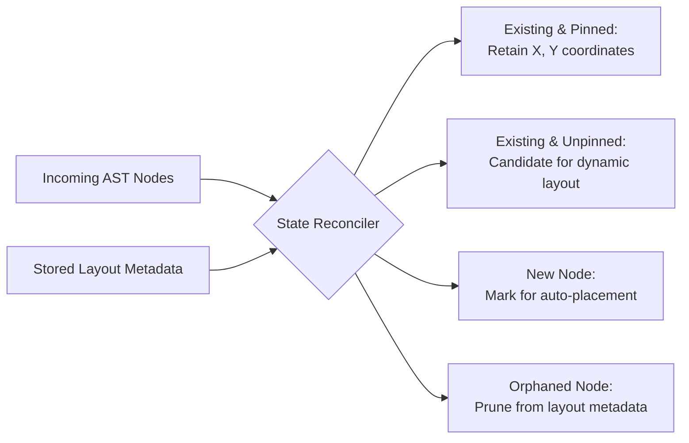
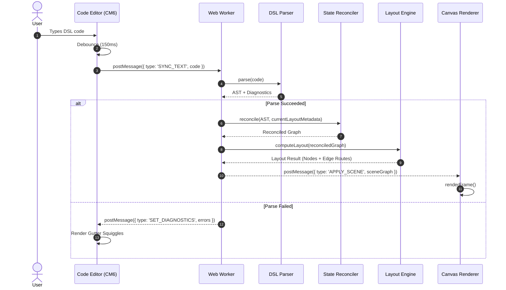
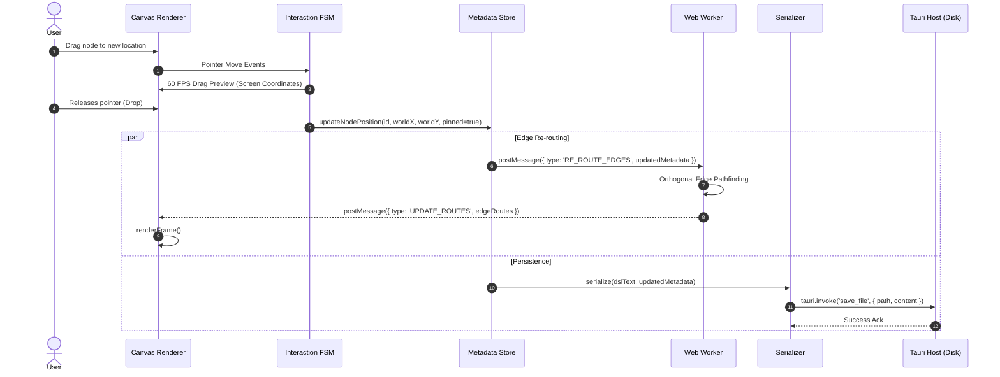

# FlexDiagram Technical Architecture

**Document Version:** 1.0.0  
**Status:** Approved / Living Architecture Document  
**Date:** September 4, 2026  
**Project:** FlexDiagram (*Code first, Shape later*)  

---

## 1. System Overview

FlexDiagram is a developer-centric diagramming environment engineered around the philosophy of **"Code first, Shape later."** Traditional diagramming tools force users into a false dichotomy: either rely completely on automated layout engines (e.g., Graphviz, PlantUML, Mermaid) that reshuffle and destroy mental models whenever a new node is added, or spend excessive manual labor dragging shapes, snapping arrows, and styling boxes in visual diagramming tools (e.g., Draw.io, Visio).

FlexDiagram resolves this tension by marrying rapid, declarative DSL text authoring with free-form, canvas-level manual position fine-tuning. The system maintains a continuous, bidirectional closed loop between code, layout calculation, and interactive canvas manipulation.

```
       ┌────────────────────────────────────────────────────────┐
       │                 FlexDiagram Closed Loop                │
       ▼                                                        │
┌──────────────┐     ┌──────────────┐     ┌──────────────────┐  │
│ 1. DSL Code  │────▶│ 2. Parse &   │────▶│ 3. Layout Engine │  │
│    Editor    │     │  Reconcile   │     │ (Dagre + Cola)   │  │
└──────────────┘     └──────────────┘     └────────┬─────────┘  │
       ▲                                           │            │
       │                                           ▼            │
       │                                  ┌──────────────────┐  │
       │                                  │ 4. Interactive   │  │
       │                                  │    Canvas        │──┘
       │                                  └────────┬─────────┘
       │                                           │
       └───────────────────────────────────────────┘
         (Drag & Drop Updates Layout Metadata)
```

### 1.1 High-Level Architecture

The FlexDiagram application runs as a lightweight, cross-platform desktop application powered by **Tauri v2** with a Rust-based platform shell and a high-performance TypeScript/Web frontend.

```mermaid
graph TB
    subgraph Host["Desktop Shell (Tauri v2 / Rust)"]
        FS[File System Manager]
        WinMgr[Window & Menu Manager]
        Exporter[Native Export Engine - PNG / SVG / PDF]
    end

    subgraph Frontend["Application UI & Runtime (TypeScript)"]
        subgraph EditorDomain["Text & Editing Subsystem"]
            EditorUI["Code Editor (CodeMirror 6)"]
            WorkerBridge["Web Worker Orchestrator"]
        end

        subgraph Worker["Background Web Worker"]
            Parser["DSL Parser\n(Recursive Descent / PEG)"]
            Reconciler["State Reconciler\n(AST + Layout Metadata)"]
            LayoutEng["Hybrid Layout Engine\n(Dagre + WebCola)"]
            EdgeRouter["Orthogonal Edge Router\n(Obstacle Avoidance)"]
        end

        subgraph CanvasDomain["Visual & Rendering Subsystem"]
            CanvasUI["Interactive Canvas (Canvas 2D / PixiJS)"]
            HitTest["Hit Tester & QuadTree Index"]
            ViewportMgr["Viewport & Transform Controller"]
            InteractionFSM["Canvas Interaction State Machine"]
        end

        subgraph Persistence["Storage & Serialization Subsystem"]
            Serializer["Serializer / Deserializer (.diag)"]
            MetadataTable["Layout Metadata Store"]
        end
    end

    %% Flow connections
    EditorUI -->|Raw DSL Text| WorkerBridge
    WorkerBridge -->|DSL String| Parser
    Parser -->|AST| Reconciler
    MetadataTable -->|Layout Overrides| Reconciler
    Reconciler -->|Reconciled Graph| LayoutEng
    LayoutEng -->|Computed Nodes| EdgeRouter
    EdgeRouter -->|Resolved Scene Graph| WorkerBridge
    WorkerBridge -->|Scene Graph Data| CanvasUI

    CanvasUI -->|Pointer Events| InteractionFSM
    InteractionFSM -->|Selection / Hover| HitTest
    InteractionFSM -->|Pan / Zoom| ViewportMgr
    InteractionFSM -->|Node Drag End (Pinned x,y)| MetadataTable

    MetadataTable -->|Dirty State| Serializer
    EditorUI -->|DSL Buffer| Serializer
    Serializer -->|Write .diag| FS
    FS -->|Read .diag| Serializer
    Serializer -->|Hydrate Code| EditorUI
    Serializer -->|Hydrate Metadata| MetadataTable

    CanvasUI -.->|Render Stream| Exporter
    Exporter -.->|Save File| FS
```

### 1.2 Core 4-Step Pipeline

1. **Step 1: Text Authoring to AST**  
   The user types declarative diagram syntax in the code editor. On edit (debounced), the DSL parser tokenizes and builds an Abstract Syntax Tree (AST) containing normalized node identifiers, human-readable labels, shapes, and directed/labeled edges.
2. **Step 2: AST & Metadata Reconciliation**  
   The State Reconciler merges the fresh AST with the persisted `LayoutMetadata` table. Nodes tagged with manual coordinates (`pinned: true`) retain their exact user-specified positions. Newly declared or unpinned nodes are marked as candidates for algorithmic placement. Deleted nodes are pruned.
3. **Step 3: Constraint Layout & Orthogonal Routing**  
   The Layout Engine calculates coordinates for floating nodes using Dagre/WebCola while treating pinned nodes as immovable geometric constraints. Once node bounding boxes are resolved, the Edge Router constructs orthogonal, obstacle-avoiding edge waypoints.
4. **Step 4: Interactive Canvas Rendering & Feedback**  
   The Canvas Renderer paints nodes, ports, labels, and orthogonal lines at 60 FPS. When a user drags a node to a custom position, the canvas marks that node as `pinned: true`, updates its `(x, y)` coordinates, persists the change into the layout metadata block of the `.diag` file, and triggers incremental edge re-routing without disturbing the rest of the diagram.

---

## 2. Component Architecture

### 2.1 DSL Parser Module

The DSL Parser is responsible for transforming raw user-entered text into a strictly typed, immutable AST. It enforces syntactic validity while tolerating mid-keystroke incomplete expressions.

#### Inputs and Outputs
- **Input:** Raw DSL text string (UTF-8).
- **Output:** `ASTResult` object containing either a successfully parsed `DiagramAST` or a structured list of `ParseError` diagnostic tokens.

```
Raw DSL Text ───▶ [Lexer / Tokenizer] ───▶ [Syntactic Parser] ───▶ DiagramAST + ParseError[]
```

#### Syntax Specification (MVP)
The DSL syntax is deliberately minimal, intuitive, and whitespace-tolerant:
```
// Declarations and connections
[Client] -> [Gateway] : REST
[Gateway] -> [Auth Service] : gRPC
[Gateway] -> [Order Service] : gRPC
[Order Service] -> (Database) : SQL Write
(Database) -> [Analytics Engine] : CDC Event
```
- Node Shapes:
  - `[...]` = Rectangle node (default compute / service entity)
  - `(...)` = Cylinder / Database storage entity
  - `<...>` = Diamond decision entity (future)
  - `{...}` = Subgraph / Cluster boundary (future)
- Edge Operators & Styles:
  - `->` or `-->` = Unidirectional solid arrow (`style: 'solid'`)
  - `..>` = Dotted arrow (`style: 'dotted'`)
  - `-.->` = Dashed arrow (`style: 'dashed'`)
  - `<->` = Bidirectional solid arrow (`style: 'solid'`)
  - `<..>` = Bidirectional dotted arrow (`style: 'dotted'`)
  - `---` = Undirected solid link (`style: 'solid'`)
  - `...` = Undirected dotted link (`style: 'dotted'`)
- Metadata Decorator:
  - `: <label>` = Edge description/label text
- Comments & Directives:
  - `//` and `/* ... */` = Standard C-style comments
  - `'` = PlantUML single-quote comments
  - Tolerates and silently ignores `@startuml`, `@enduml`, `!theme`, `skinparam`, `title`, `header`, `footer` directives.

#### Stable ID Assignment
A critical requirement of the parser is generating **Stable IDs** for nodes. If a user renames an entity or changes formatting, node identities must remain deterministic to prevent breaking layout overrides.
- In MVP, the node name enclosed within the delimiter serves as its base identifier:
  `id = slugify(nodeName)` (e.g., `[Auth Service]` $\rightarrow$ `auth-service`).
- If explicit aliasing is added (e.g., `[as: Auth Service]`), the alias serves as the primary Stable ID.

#### Error Handling and Diagnostics
The parser produces structured errors conforming to language server conventions:
- **Zero Panic:** Parser does not throw unhandled exceptions; it captures recoverable errors and returns a partial AST alongside diagnostics.
- **Diagnostics Structure:** `line`, `column`, `length`, `severity` (`Error` | `Warning`), and descriptive error messages formatted for editor gutter markers.

```typescript
export interface SourceLocation {
  line: number;
  column: number;
  offset: number;
}

export interface ParseError {
  message: string;
  location: {
    start: SourceLocation;
    end: SourceLocation;
  };
  severity: 'error' | 'warning';
}
```

#### Technology Choice
Hand-written **Recursive Descent Parser with a separate Lexer**.
- *Rationale:* Zero external dependencies, minimal bundle footprint (< 10 KB), precise control over error recovery/resynchronization (e.g., advancing to the next newline upon encountering a malformed statement), and zero code-generation overhead compared to parser generators.

---

### 2.2 State Reconciler

The State Reconciler bridges declarative text and imperative graphical positioning. It is the component that fulfills the promise of "code first, shape later" by maintaining position stability across code edits.



#### Reconciliation Algorithm
When an updated AST arrives:
1. **Map Existing State:** Index existing nodes from `LayoutMetadata` by their `StableID`.
2. **Diff AST Nodes Against State:**
   - **Case 1 (Preserved Node, Pinned):** Node ID exists in metadata with `pinned: true`. The existing `(x, y)` coordinate is strictly preserved.
   - **Case 2 (Preserved Node, Unpinned):** Node ID exists with `pinned: false`. Node is queued for incremental layout update.
   - **Case 3 (New Node):** Node ID does not exist in metadata. Node is tagged with `isNew: true` and queued for smart placement adjacent to its connected neighbors.
   - **Case 4 (Renamed/Modified Attributes):** Node ID matches, but label or shape changed. Updates node visual properties without resetting coordinate position.
3. **Prune Stale State:** Node IDs present in metadata but absent from the new AST are flagged as deleted. Their coordinates are discarded or archived in an undo stack.
4. **Output Generation:** Emits a unified `ReconciledGraph` containing active nodes annotated with positioning rules.

---

### 2.3 Layout Engine

The Layout Engine calculates 2D geometric representations for nodes and edges. It implements a hybrid paradigm: topological hierarchical ordering for overall graph structure, combined with constraint-based stabilization for user-pinned elements.

```
Reconciled Graph ───▶ [Dagre Layering] ───▶ [WebCola Constraint Solve] ───▶ [Orthogonal Router]
```

#### Hybrid Layout Strategy
1. **Topological Hierarchy (Dagre / Sugiyama Framework):**
   - Ideal for directed flow diagrams (e.g., microservices, pipelines, request flows).
   - Assigns unpinned nodes into discrete layers (ranks) to enforce monotonic edge directionality (top-to-bottom or left-to-right).
2. **Constraint-Based Refinement (WebCola):**
   - Applies force-directed relaxation augmented by linear mathematical constraints.
   - **Pinned Constraint:** Pinned nodes are assigned fixed position equality constraints ($x_i = X_0, y_i = Y_0$).
   - **Non-Overlap Constraint:** Bounding boxes for all nodes are constrained with separation inequalities ($|x_i - x_j| \ge \frac{w_i + w_j}{2} + \text{padding}$).
   - **Neighbor Affinity:** New nodes (`isNew: true`) are placed using an attraction vector toward their immediate graph neighbors while satisfying non-overlap constraints.

#### Edge Routing: Orthogonal Routing with Obstacle Avoidance
Edges are not simple straight lines; they must maneuver cleanly around node bodies:
- **Port Computation:** Connection ports are placed dynamically on the 4 borders of the source and target node bounding boxes (North, South, East, West), selecting the pair that minimizes Manhattan distance and directional deflection.
- **Grid-Based A* Pathfinding (Manhattan Routing):**
  - The canvas area is mapped onto a coarse routing grid (e.g., 10px pitch).
  - Node bounding boxes with padding act as high-cost obstacles.
  - An $A^*$ search finds paths with the lowest cost, penalizing segment turns (bends) to guarantee clean, minimal 90-degree orthogonal routes.
- **Label Placement:** Edge labels are placed at the midpoint of the longest horizontal or vertical segment of the computed route to prevent collision with node boundaries.

---

### 2.4 Canvas Renderer

The Canvas Renderer transforms the computed scene graph into a responsive 60 FPS interactive viewport.

#### Rendering Pipeline
Each frame execution adheres to a strict, sequential pipeline:

```
┌──────────────────────────────────────────────────────────────┐
│                    Frame Rendering Cycle                     │
├──────────────────────────────────────────────────────────────┤
│ 1. Clear Viewport Context                                    │
│ 2. Apply World Transform Matrix (Pan Offset & Zoom Scale)    │
│ 3. Render Background Grid (Dot matrix or subtle infinite grid)│
│ 4. Render Edge Paths (Glow / Lines / Directional Arrowheads) │
│ 5. Render Edge Labels (Pill background + centered text)      │
│ 6. Render Node Bodies & Borders (Rounded Rects / Cylinders)  │
│ 7. Render Node Text & Icons                                  │
│ 8. Reset Transform to Screen Space                           │
│ 9. Render Interaction Overlays (Selection Box, Snap Guides)  │
└──────────────────────────────────────────────────────────────┘
```

#### Coordinate Systems and Viewport Matrix
The renderer operates across two primary coordinate planes:
1. **World Coordinates:** The infinite, unconstrained 2D Cartesian plane where nodes, edges, and waypoints reside ($x_w, y_w \in (-\infty, +\infty)$).
2. **Screen (Viewport) Coordinates:** The physical device pixel coordinates within the `<canvas>` element ($x_s \in [0, \text{width}], y_s \in [0, \text{height}]$).

The relationship is governed by the 2D affine transform matrix:
$$x_s = (x_w \cdot \text{scale}) + \text{pan}_x$$
$$y_s = (y_w \cdot \text{scale}) + \text{pan}_y$$

Inverse transform (Screen to World) for pointer hit testing:
$$x_w = \frac{x_s - \text{pan}_x}{\text{scale}}$$
$$y_w = \frac{y_s - \text{pan}_y}{\text{scale}}$$

#### Interaction Handling
- **Spatial Indexing (QuadTree):** All node bounding boxes are indexed in a QuadTree. Cursor interactions (`pointerdown`, `pointermove`, `pointerup`) execute $O(\log N)$ hit tests.
- **Drag Detection:**
  - Pointer down on node bounds $\rightarrow$ Capture node ID, initialize drag delta.
  - Pointer move $\rightarrow$ Update candidate node coordinate in World space. Render immediate visual feedback at 60 FPS.
  - Pointer up $\rightarrow$ Commit new position: dispatch `NODE_DRAG_COMMITTED` event with `pinned: true`.
- **Canvas Navigation & Tool Modes:**
  - **Left-Click Empty Space Pan:** Clicking and dragging on empty canvas space pans the viewport without requiring modifier keys.
  - **Tool Mode Switcher:** Floating HUD toggle between Pan mode (`✋ Pan` / <kbd>H</kbd>) and Select mode (`↖ Select` / <kbd>V</kbd>).
  - **Modifier Navigation:** Middle-click drag, two-finger trackpad drag, or holding <kbd>Space</kbd> enables pan navigation from any state.
  - **Zoom:** Mouse wheel handles geometric zoom centered on the current cursor coordinate.
- **Grid Rendering Control:**
  - Configurable `showGrid` boolean parameter controlling whether the background dot matrix is painted during frame cycles.
- **Theming Subsystem:**
  - Unified `RenderTheme` model supporting both Dark Theme (`DARK_THEME`) and White/Light Theme (`LIGHT_THEME`).
  - Specialized color tokens including `nodeCylinderCap` (`#e2e8f0` in light, `#222733` in dark) ensuring visual depth across themes.
  - Export engines (SVG, PNG) synchronize directly with the active theme.

---

### 2.5 Code Editor

The Code Editor hosts the declarative source code and acts as the entry point for textual composition.

#### Core Capabilities
- **Syntax Highlighting:** Custom language grammar highlighting node brackets `[...]`, cylinder definitions `(...)`, arrows `->`, and labels.
- **Inline Error Markers:** Highlights parse errors directly at the offending line/column with red squiggly underlines and hover tooltips.
- **Bidirectional Focus Highlighting:** Clicking a node in the visual canvas moves the editor cursor to its corresponding DSL line; clicking or moving the cursor across DSL statements highlights the target node on the canvas.

#### Change Propagation & Debounce Pipeline
To prevent thrashing the layout engine while the user is actively typing:
1. User types in editor $\rightarrow$ Editor emits `onChange` event.
2. An adaptive debouncer delays processing by **150ms–200ms**.
3. Upon debounce timeout, text is dispatched to the background Web Worker.
4. Parsing, reconciliation, and layout execution run without blocking the UI thread.
5. Worker posts the resulting scene graph to the main thread for immediate canvas redraw.

---

### 2.6 Serializer / Deserializer (.diag Format)

The `.diag` file format is a central architectural innovation of FlexDiagram: **a single, plain-text, 100% Git-friendly file** combining user-authored logic with machine-managed layout overrides.

#### File Structure
```
[Client] -> [Gateway] : REST
[Gateway] -> [Auth Service] : gRPC
[Gateway] -> [Order Service] : gRPC
[Order Service] -> (Database) : SQL Write

// @layout:v1
// {
//   "version": 1,
//   "nodes": {
//     "client": { "x": 100, "y": 150, "pinned": true },
//     "gateway": { "x": 320, "y": 150, "pinned": true },
//     "auth-service": { "x": 580, "y": 80, "pinned": false },
//     "order-service": { "x": 580, "y": 240, "pinned": true },
//     "database": { "x": 840, "y": 240, "pinned": true }
//   },
//   "viewport": {
//     "panX": 50,
//     "panY": 120,
//     "zoom": 1.0
//   }
// }
```

#### Partitioning Rules
- **Part 1 (Pure Logic):** Everything preceding the `// @layout:v1` sentinel token is treated as pure DSL code. Users can edit this in any text editor (VS Code, Neovim, Vim, Git merge tools).
- **Part 2 (Layout Metadata):** Everything following `// @layout:v1` is commented out using standard single-line comment slashes `//`. It contains serialized JSON maintaining manual coordinates, pin flags, and viewport zoom/pan states.

#### Deserialization Pipeline
1. Scan buffer for line matching `^//\s*@layout:v(\d+)`.
2. Text prior to match is extracted as DSL code string.
3. Text following match has line prefixes `// ` stripped, then parses through `JSON.parse()`.
4. If the metadata marker is missing (e.g., brand new file created outside FlexDiagram), the parser initializes an empty metadata block; the reconciler automatically assigns auto-layout positions to all nodes.

#### Serialization & Git Conflict Minimization
- Node metadata keys in JSON are sorted alphabetically before serialization to produce deterministic, minimal git diffs.
- Numeric coordinates are rounded to integers or 2 decimal places to avoid floating-point churn across different operating systems or DPI scales.

---

## 3. Data Flow Architecture

The data flow in FlexDiagram forms a strict closed loop. State updates flow unidirectionally within two distinct operational loops: the **Authoring Loop** (Text to Canvas) and the **Direct Manipulation Loop** (Canvas to Text/File).

### 3.1 Text Authoring Data Flow (Code $\rightarrow$ Canvas)



### 3.2 Visual Manipulation Data Flow (Canvas $\rightarrow$ Code/Metadata)



---

## 4. Key Data Structures

All data contracts across the parser, reconciler, layout engine, and storage layers are defined as immutable, strongly typed TypeScript interfaces.

```typescript
/**
 * Supported geometric shapes for diagram nodes.
 */
export type NodeShape = 'rectangle' | 'cylinder' | 'diamond' | 'cloud';

/**
 * Line styling for directed and undirected edges.
 */
export type EdgeStyle = 'solid' | 'dashed' | 'dotted';

/**
 * 2D Point coordinate in World space.
 */
export interface Point {
  readonly x: number;
  readonly y: number;
}

/**
 * Bounding dimensions of an entity.
 */
export interface Dimensions {
  readonly width: number;
  readonly height: number;
}

// ============================================================================
// 1. AST Model (Abstract Syntax Tree emitted by Parser)
// ============================================================================

export interface DiagramNode {
  readonly id: string;
  readonly name: string;
  readonly shape: NodeShape;
  readonly location?: SourceLocation;
}

export interface DiagramEdge {
  readonly id: string;
  readonly sourceId: string;
  readonly targetId: string;
  readonly label?: string;
  readonly style?: EdgeStyle;
  readonly location?: SourceLocation;
}

export interface AST {
  readonly nodes: readonly DiagramNode[];
  readonly edges: readonly DiagramEdge[];
  readonly errors: readonly ParseError[];
}

// Backward-compatible type aliases
export type ASTNode = DiagramNode;
export type ASTEdge = DiagramEdge;
export type DiagramAST = AST;

// ============================================================================
// 2. Reconciler and Layout Graph Models
// ============================================================================

export interface NodeState {
  readonly id: string;
  readonly name: string;
  readonly label: string;
  readonly shape: NodeShape;
  x: number;
  y: number;
  width: number;
  height: number;
  pinned: boolean;
  isNew: boolean;
}

export interface EdgeWaypoint extends Point {
  readonly isControlPoint?: boolean;
}

export interface EdgeRoute {
  readonly edgeId: string;
  readonly sourceId: string;
  readonly targetId: string;
  readonly label?: string;
  readonly style?: EdgeStyle;
  readonly waypoints: readonly EdgeWaypoint[];
  readonly labelPosition?: Point;
}

export interface SceneGraph {
  readonly nodes: readonly NodeState[];
  readonly edges: readonly EdgeRoute[];
  readonly boundingBox: {
    minX: number;
    minY: number;
    maxX: number;
    maxY: number;
  };
}

// ============================================================================
// 3. Layout Metadata & Viewport State
// ============================================================================

export type CanvasMode = 'select' | 'pan';

export interface NodeLayoutOverride {
  readonly x: number;
  readonly y: number;
  readonly pinned: boolean;
  readonly customColor?: string;
}

export interface ViewportState {
  panX: number;
  panY: number;
  zoom: number;
}

export interface LayoutMetadata {
  readonly version: 1;
  readonly nodes: Record<string, NodeLayoutOverride>;
  readonly viewport: ViewportState;
}

export interface RenderTheme {
  readonly canvasBg: string;
  readonly gridDot: string;
  readonly nodeBg: string;
  readonly nodeStroke: string;
  readonly nodeCylinderCap: string;
  readonly nodeSelectedStroke: string;
  readonly textPrimary: string;
  readonly textSecondary: string;
  readonly edgeDefault: string;
  readonly edgeSelected: string;
}

// ============================================================================
// 4. File Serialization Container (.diag File Model)
// ============================================================================

export interface DiagFile {
  readonly filePath?: string;
  readonly dslContent: string;
  readonly metadata: LayoutMetadata;
  readonly isDirty: boolean;
}
```

---

## 5. Technology Decisions

The architectural selections for FlexDiagram prioritize responsiveness, minimal memory footprint, zero layout jitter, and cross-platform native capability.

| Decision Area | Options Considered | Chosen Technology | Architectural Rationale |
| :--- | :--- | :--- | :--- |
| **Desktop Shell** | Electron, Tauri v2, Flutter Desktop | **Tauri v2 (Rust)** | Installer footprint `< 15 MB`, idle RAM `< 60 MB` (vs Electron's 150MB+ installer and 300MB+ RAM). Native file system access and fast Rust-based export pipeline. |
| **Canvas Renderer** | SVG / DOM, HTML5 Canvas 2D, PixiJS (WebGL) | **HTML5 Canvas 2D (Phase 1/2) $\rightarrow$ PixiJS (Phase 3)** | Canvas 2D provides immediate-mode rendering with minimal complexity, crisp vector typography, and smooth 60 FPS performance for typical diagrams (100–500 nodes). PixiJS provides a drop-in upgrade path for high node counts. |
| **Code Editor** | Monaco Editor, CodeMirror 6, Ace Editor | **CodeMirror 6** | CodeMirror 6 is modular, lightweight (< 300 KB vs Monaco's 5 MB+), mobile/web friendly, and has state-based transactional APIs well-suited for bidirectional binding. |
| **Auto-Layout Engine** | Graphviz (Wasm), ELK (Eclipse), Dagre, WebCola | **Dagre (Hierarchical) + WebCola (Constraints)** | Graphviz is inflexible with pinned coordinates. Dagre generates clean Sugiyama DAG hierarchies. WebCola resolves positional equality constraints ($x = X_0$) for pinned nodes without collapsing unpinned layouts. |
| **DSL Parser** | Peggy.js (PEG), Chevrotain, Hand-written Recursive Descent | **Hand-written Recursive Descent** | Complete control over tokenization, error recovery, partial AST generation on incomplete lines, zero external dependencies, and optimal execution speed. |
| **State Synchronization** | Automerge / CRDTs, Custom Reconciler + Comment JSON | **Custom State Reconciler + Comment JSON Metadata** | High transparency: plain-text `.diag` files are 100% human-readable and Git mergeable. Avoids the overhead and file bloat of binary or CRDT storage formats. |

---

## 6. Directory Structure

The project follows a standard Tauri v2 multi-tier workspace layout, strictly isolating the Rust native bridge from the frontend application layers:

```
flexdiagram/
├── Cargo.toml                       # Cargo workspace manifest
├── package.json                     # NPM workspace root manifest
├── tsconfig.json                    # Strict TypeScript compiler options
├── vite.config.ts                   # Vite configuration for frontend bundler
│
├── src-tauri/                       # Native Desktop Shell (Rust)
│   ├── Cargo.toml                   # Rust dependencies (tauri v2, serde, image)
│   ├── tauri.conf.json              # Window dimensions, IPC permissions, security
│   ├── icons/                       # Application icons (macOS, Windows, Linux)
│   └── src/
│       ├── main.rs                  # Application bootstrap
│       ├── commands/                # Tauri IPC command handlers
│       │   ├── fs_io.rs             # Safe file read/write operations
│       │   └── exporter.rs          # Headless SVG/PNG rendering & export
│       └── menu.rs                  # Native menu items & keyboard shortcuts
│
├── src/                             # Frontend Application (TypeScript)
│   ├── app/                         # App shell, state stores, and layout frames
│   │   ├── App.tsx                  # Main window shell & split-pane host
│   │   ├── store.ts                 # Centralized reactive state store
│   │   └── theme.css                # Dark/light mode styling tokens
│   │
│   ├── parser/                      # Declarative DSL Parser
│   │   ├── lexer.ts                 # Tokenizer & streaming scanner
│   │   ├── parser.ts                # Recursive descent parser implementation
│   │   ├── ast.ts                   # AST type definitions & node builders
│   │   └── errors.ts                # Syntax diagnostics & source mapping
│   │
│   ├── reconciler/                  # State Reconciliation Subsystem
│   │   ├── reconciler.ts            # AST & metadata diffing engine
│   │   └── stable_id.ts             # Deterministic identifier generator
│   │
│   ├── layout/                      # Graph Geometry & Routing Subsystem
│   │   ├── layout_engine.ts         # Hybrid Dagre + WebCola coordinator
│   │   ├── orthogonal_router.ts     # A* obstacle-avoiding edge pathfinder
│   │   └── worker_controller.ts     # Web Worker client interface
│   │
│   ├── canvas/                      # Interactive Canvas Viewport
│   │   ├── canvas_view.tsx          # Canvas DOM host component
│   │   ├── renderer_2d.ts           # Canvas2D immediate-mode render loop
│   │   ├── viewport.ts              # Pan/zoom affine matrix math
│   │   ├── hit_test.ts              # Spatial QuadTree & bounding box picking
│   │   └── interaction_fsm.ts       # Drag, select, hover interaction state machine
│   │
│   ├── editor/                      # Text Editor Integration
│   │   ├── editor_view.tsx          # CodeMirror 6 React wrapper component
│   │   ├── syntax_highlighter.ts    # Custom DSL syntax highlighting grammar
│   │   └── diagnostic_adapter.ts    # ParseError -> CodeMirror lint adapter
│   │
│   ├── serializer/                  # Persistence & Format Codec
│   │   ├── serializer.ts            # AST + Metadata -> .diag text writer
│   │   └── deserializer.ts          # .diag text -> AST + Metadata reader
│   │
│   ├── types/                       # Shared TypeScript Interfaces
│   │   └── index.ts                 # Unified type exports (NodeState, Point, etc.)
│   │
│   └── workers/                     # Web Worker Execution Context
│       └── layout.worker.ts         # Offloaded parser & layout solver worker
│
├── docs/                            # Project Documentation
│   ├── ARCHITECTURE.md              # System Architecture & Technical Specifications
│   └── SPECIFICATION.md             # DSL Language Specification & Grammar Rules
│
└── tests/                           # Automated Verification Suite
    ├── unit/
    │   ├── parser.test.ts           # Syntax edge cases & error recovery tests
    │   ├── reconciler.test.ts       # Node pin preservation tests
    │   └── serializer.test.ts       # Round-trip .diag read/write integrity
    └── integration/
        └── loop_sync.test.ts        # End-to-end bidirectional synchronization tests
```

---

## 7. Performance Considerations

To fulfill the requirements of fluid interaction and responsiveness, FlexDiagram enforces strict computational performance budgets.

```
60 FPS Target: Total Frame Budget = 16.6ms
┌──────────────────────┬──────────────────────┬──────────────────────┐
│ Clear & Matrix Trans │ Draw Nodes & Edges   │ Draw UI Overlays     │
│       ~ 0.8ms        │       ~ 5.2ms        │       ~ 1.1ms        │
└──────────────────────┴──────────────────────┴──────────────────────┘
[Total Render Time: ~ 7.1ms | Remaining Idle Headroom: ~ 9.5ms]
```

### 7.1 Canvas 16.6ms Rendering Budget (60 FPS)
- **Immediate-Mode Path Caching:** Static node geometries (rounded rectangle paths, cylinder top/bottom ellipses) are pre-compiled into reusable `Path2D` instances to eliminate redundant path-construction CPU cycles.
- **Batched Style Draws:** Minimizes context switching on the canvas (e.g., all node bodies are filled in one batch, then all node borders are stroked in a single operation).
- **Text Measurement Cache:** Canvas `ctx.measureText()` is costly; label metrics and dimensions are calculated once during layout computation and cached within the node state.

### 7.2 Adaptive Debouncing
- Typing in the code editor updates the local text buffer instantly.
- Code changes trigger an adaptive **150ms–200ms debounce timer** before initiating parsing and layout calculation.
- If keystrokes occur in rapid succession (e.g., continuous typing), parsing is postponed until typing pauses, keeping the main thread free for fluid editor interactions.

### 7.3 Background Web Worker Offloading
All heavy computational workloads are isolated from the main UI thread:
- **Offloaded Tasks:** Tokenization, AST validation, WebCola quadratic programming constraint solving, and A* orthogonal routing run exclusively inside `layout.worker.ts`.
- **Zero UI Freezes:** Even for graphs containing hundreds of nodes where layout resolution takes 50–100ms, the canvas continues panning, zooming, and tracking user pointer input at a smooth 60 FPS.

### 7.4 Spatial Indexing & Virtual Culling
Diagrams with large node counts leverage spatial visibility culling:
- **QuadTree Broad-Phase Culling:** Before painting, the renderer queries the QuadTree with the current Viewport bounding box ($[x_{\min}, y_{\min}, x_{\max}, y_{\max}]$).
- **Cull Threshold:** Only nodes and edge segments that intersect the visible viewport rectangle are sent to the canvas graphics pipeline. Off-screen elements consume zero draw calls.

---

## 8. MVP Roadmap Alignment

| Phase | Milestone Name | Key Deliverables & Capabilities |
| :---: | :--- | :--- |
| **Phase 1** | **Core Engine (CLI / Web Preview)** | - Hand-written DSL Parser & AST generation<br>- Dagre-based auto-layout engine<br>- Interactive 2D Canvas with Pan, Zoom, and Drag-and-Drop<br>- Basic state reconciliation (retaining coordinates on drag) |
| **Phase 2** | **Sync & Persistence** | - `.diag` file serializer/deserializer with `// @layout:v1` metadata blocks<br>- Incremental layout with WebCola constraint solving<br>- Orthogonal edge routing with obstacle avoidance<br>- Bidirectional cursor and canvas selection sync |
| **Phase 3** | **Cross-Platform Application** | - Tauri v2 packaging (< 15 MB installer, macOS/Linux/Windows)<br>- Split-view CodeMirror 6 editor with syntax diagnostics<br>- Native high-resolution export engine (PNG, SVG, PDF)<br>- Visual style customization and theme toggles |

---

> [!NOTE]
> All file path references, interfaces, and architecture contracts in this document serve as the baseline specification for FlexDiagram development starting September 4, 2026.
