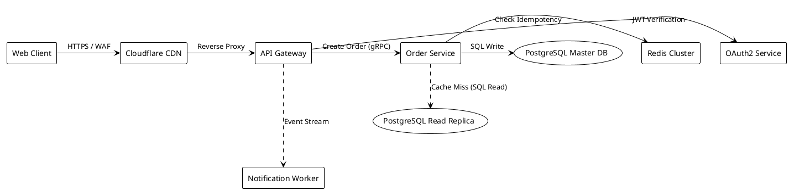

# FlexDiagram — Interactive Demo & User Showcase

> *"Code first, Shape later"*

Welcome to **FlexDiagram**! This document provides a walkthrough of the core user interactions and value propositions.

---

## 1. Quick Tour & Core Workflow

### Step 1: Code First (Declarative DSL Authoring)
In the left editor pane, type your diagram elements using clean, intuitive syntax:

```
[Client] -> [API Gateway] : HTTPS
[API Gateway] -> [Auth Service] : JWT Validate
[API Gateway] -> [Order Service] : gRPC
[Order Service] -> (PostgreSQL DB) : SQL Write
(PostgreSQL DB) -> [Analytics Worker] : CDC Log
```

Notice that as you type, FlexDiagram automatically compiles your AST and calculates a clean Dagre hierarchical layout in real time.

```
       [Client]
          │ (HTTPS)
          ▼
    [API Gateway]
       ├── (JWT Validate) ──► [Auth Service]
       └── (gRPC)         ──► [Order Service]
                                  │ (SQL Write)
                                  ▼
                          (PostgreSQL DB)
                                  │ (CDC Log)
                                  ▼
                          [Analytics Worker]
```

---

### Step 2: Shape Later (Free-Form Canvas Repositioning)
Hover over any node on the interactive canvas on the right pane:
1. **Drag any node** to your preferred location.
2. Notice the **smart alignment guides** (sky-blue dashed lines) that snap center-lines and borders when aligned with peers.
3. Connected **orthogonal edges dynamically re-route around obstacles** in real time.
4. When you release the mouse, an **amber pin indicator (📍)** appears, locking its position.

---

### Step 3: Closed-Loop Stability (Edit Code Without Position Reset)
The biggest pain point of traditional tools (Mermaid, Graphviz, PlantUML) is that adding one line resets all your manual layout adjustments.

In FlexDiagram:
1. Add a new service to the code:
   ```
   [Order Service] -> [Payment Gateway] : Process Card
   ```
2. **Your pinned nodes remain locked in their exact manual coordinates!**
3. The new `[Payment Gateway]` node is placed cleanly into adjacent free space without disturbing your existing mental model.

---

### Step 4: Multi-Node Selection & Group Drag
- **Marquee Selection**: Click and drag on empty canvas space to draw a selection rectangle over multiple nodes.
- **Shift-Click**: Click individual nodes while holding `Shift` to toggle them in or out of the selection.
- **Group Drag**: Drag any selected node to translate the entire group together while preserving relative spacing.

---

### Step 5: Full Undo / Redo
- Click the **↶ Undo** or **↷ Redo** buttons in the toolbar, or use standard shortcuts:
  - **Undo**: `Ctrl+Z` (or `Cmd+Z` on macOS)
  - **Redo**: `Ctrl+Shift+Z` or `Ctrl+Y` (or `Cmd+Shift+Z` on macOS)

---

### Step 6: Git-Friendly `.diag` File Format
Click **Save** or inspect your saved `.diag` file:

```
[Client] -> [API Gateway] : HTTPS
[API Gateway] -> [Auth Service] : JWT Validate
[API Gateway] -> [Order Service] : gRPC
[Order Service] -> (PostgreSQL DB) : SQL Write
(PostgreSQL DB) -> [Analytics Worker] : CDC Log

// @layout:v1
// {
//   "version": 1,
//   "nodes": {
//     "api-gateway": {
//       "x": 320,
//       "y": 180,
//       "pinned": true
//     },
//     "client": {
//       "x": 120,
//       "y": 180,
//       "pinned": true
//     }
//   },
//   "viewport": {
//     "panX": 60,
//     "panY": 60,
//     "zoom": 1
//   }
// }
```

- Logic code lives at the top in plain text.
- Layout overrides live in the commented JSON block at the bottom, alphabetically sorted by key for minimal, clean Git diffs.

---

### Step 7: Publication-Quality Export
Open the **Export ▾** menu in the top right to download:
- **SVG Vector (.svg)**: Infinite resolution, editable in Illustrator/Figma, embeddable on GitHub or documentation websites.
- **PNG (2x Retina / 3x High-Res)**: Crisp raster image perfect for pitch decks and slides.
- **Print / PDF Vector**: Printable vector architecture specification sheets.

---

### Step 8: Copy-Paste PlantUML Architectures
FlexDiagram allows pasting existing PlantUML diagrams directly into the editor:



- Directives like `@startuml`, `@enduml`, `!theme`, and `skinparam` are silently tolerated.
- Single-quote `'` comments are stripped.
- Dotted arrows (`..>`) and dashed arrows (`-.->`) are automatically recognized and rendered with crisp line dashing.

---

### Step 9: White / Light Theme
- Click the **☀️ Light** button in the header toolbar to switch to a clean white canvas (`#ffffff`), high-contrast dark text, and subtle node outlines.
- Notice database cylinders render cleanly with light-toned caps (`#e2e8f0`).
- Exporting to SVG or PNG while in Light theme automatically produces light-themed graphics for white slide decks or light documentation pages.
- Click **🌙 Dark** at any time to return to dark mode.

---

### Step 10: Canvas Pan Navigation & Grid Controls
- **Click-and-Hold Left Mouse Pan**: Click and hold anywhere on the empty canvas to pan around effortlessly.
- **HUD Mode Switcher**: Use the floating HUD in the bottom-right corner to toggle between:
  - **✋ Pan Mode** (<kbd>H</kbd>): Click-and-drag pans the canvas from anywhere.
  - **↖ Select Mode** (<kbd>V</kbd>): Click-and-drag on empty space draws marquee box selection; drag on nodes repositions them.
- **Grid Toggle**: Click **▦ Grid** / **⬚ Grid** in the header or HUD to hide or show background dot indicators.
