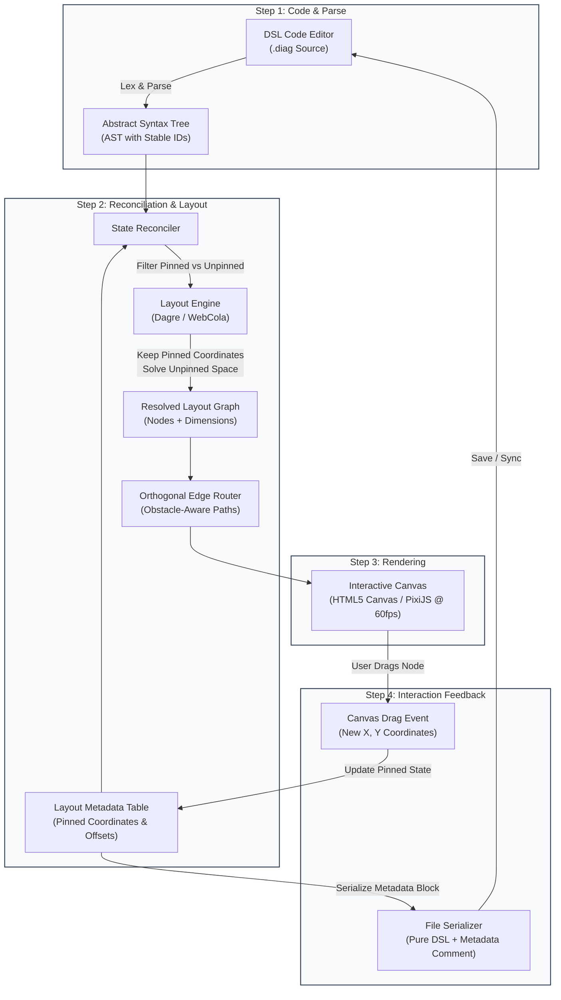

# FlexDiagram — Project Overview

> **Tagline:** Code first, Shape later  
> **Start Date:** September 4, 2026  
> **Status:** Active Development  
> **Repository Target:** [docs/PROJECT_OVERVIEW.md](file:///home/thanhduy/Projects/FlexDiagram/docs/PROJECT_OVERVIEW.md)

---

## 1. Project Name & Mission

**FlexDiagram** is a next-generation architecture diagramming tool designed around a single guiding philosophy: **"Code first, Shape later."**

### Mission Statement
To eliminate the frustration of auto-layout diagram overlap and layout churn by uniting the authoring velocity of code-driven diagrams with the spatial precision of free-form canvas fine-tuning.

Developers, architects, and system engineers naturally organize structural thoughts through code and text. However, visual diagrams are consumed spatially. Existing tools force an agonizing choice: either surrender visual layout to uncontrollable algorithmic placement, or spend hours dragging boxes across a manual canvas. FlexDiagram eliminates this compromise.

---

## 2. Problem Statement: The Modern Diagramming Dilemma

Engineering teams today are trapped between two distinct, flawed paradigms:

```
+------------------------------------+------------------------------------+
| Paradigm A: Pure Text / Auto-Layout| Paradigm B: Pure GUI / Canvas      |
| (Mermaid, PlantUML, Graphviz)      | (Draw.io, Lucidchart, Miro)        |
+------------------------------------+------------------------------------+
| [+] Fast, keyboard-only authoring  | [+] Pixel-perfect spatial control  |
| [+] Git-friendly plain text diffs  | [+] Intuitive drag-and-drop        |
| [-] Fragile layout "black box"     | [-] Tedious manual box drawing     |
| [-] Single edit reshuffles canvas  | [-] Binary or messy XML/JSON diffs |
| [-] Zero fine-grained repositioning| [-] Disconnected from source code  |
+------------------------------------+------------------------------------+
```

### The Core Frustrations

1. **The Auto-Layout Chaos Factor:**  
   In tools like Mermaid or PlantUML, modifying a single connection or adding a leaf node often causes the Sugiyama auto-layout engine to drastically reorder clusters, invert directionality, or route edges directly across existing labels. The author has no mechanism to pin a node to a stable `(x, y)` coordinate.
2. **The Drag-and-Drop Tax:**  
   In visual editors like Draw.io or Miro, drafting an architecture requires repetitive mouse clicks, manual box alignment, manual arrow snapping, and manual grid management. Drafting complex architectures becomes a chore rather than a flow state.
3. **Loss of the Spatial Mental Model:**  
   Humans remember visual diagrams by landmarks (e.g., "the Database is in the bottom-right corner", "the Client Gateway sits on the far left"). When auto-layout tools scramble coordinates on every build, the user's mental model is shattered.
4. **Version Control Hostility:**  
   GUI diagrams save as raw XML or minified JSON where moving one node produces hundreds of lines of git diff noise, making code reviews and collaboration nearly impossible.

---

## 3. The Solution: "Code First, Shape Later"

FlexDiagram bridges code velocity and canvas precision through a **hybrid authoring lifecycle**:

1. **Code First:** Write clear, concise declarative DSL statements describing components, databases, and relationships. Initial placement is computed instantaneously by intelligent auto-layout engines.
2. **Shape Later:** Switch seamlessly to the interactive canvas. Drag nodes into natural visual groupings, nudge overlapping edges, and pin critical components into permanent positions.
3. **Non-Destructive Synchronization:** Moving a node on the canvas never mutates the underlying DSL logic. Instead, manual coordinates are captured in an append-only, deterministically sorted metadata block that preserves both logic and layout across team edits.

```
       [ Developer writes DSL ]
                  │
                  ▼
       ( Fast Initial Layout )
                  │
                  ▼
    [ Canvas: Drag & Pin Nodes ]
                  │
                  ▼
[ Stable, Git-Friendly .diag File ]
```

---

## 4. Core Data Pipeline

FlexDiagram operates as a **4-step closed-loop reactive pipeline**. Every change—whether triggered by a keystroke in the DSL editor or a drag event on the canvas—flows through this deterministic architecture.

### Pipeline Architecture Diagram



### Text Pipeline Overview

```
 +------------------+      +-------------------+      +---------------------+
 |  DSL Code Editor | ---> |   Parser & AST    | ---> |   State Reconciler  |
 |  (User edits)    |      | (Stable Node IDs) |      | (AST + Layout Meta) |
 +------------------+      +-------------------+      +----------+----------+
          ^                                                      |
          |                                                      v
 +--------+---------+      +-------------------+      +---------------------+
 |  File Serializer | <--- |  Interactive Canvas| <--- |   Layout Engine &   |
 |  (DSL + Metadata)|      |  (Drag & Drop UX) |      |  Orthogonal Router  |
 +------------------+      +-------------------+      +---------------------+
```

### The 4 Pipeline Steps

| Step | Stage | Primary Responsibility |
| :--- | :--- | :--- |
| **1** | **DSL Parsing** | Tokenizes text syntax, extracts node identifiers and edge relations, and assigns a deterministic **Stable ID** to every entity. |
| **2** | **State Reconciliation** | Merges the fresh AST with stored Layout Metadata. Pinned nodes retain manual $(x, y)$ coordinates; new and unpinned nodes are fed to Dagre/WebCola for collision-free positioning. Orthogonal routing calculates right-angle edge paths around node obstacles. |
| **3** | **Canvas Rendering** | Dispatches graph primitives to a 60fps hardware-accelerated canvas (HTML5 Canvas 2D / PixiJS) with frictionless pan, zoom, and selection. |
| **4** | **Interaction Feedback** | Captures user drag gestures, marks target nodes as `pinned: true`, records updated coordinates, and serializes the state back into the `.diag` file without disturbing the human-authored DSL logic. |

---

## 5. Key Architecture Concepts

```
        Pinned Node (x: 420, y: 180)             Unpinned Node (Auto-positioned)
       +----------------------------+            +----------------------------+
       | [X] Pinned Position        |            | [ ] Flow Placement         |
       | User-dragged landmark      |            | Dynamic Dagre coordinate   |
       | Ignored by solver shift    |            | Snaps to optimal whitespace|
       +----------------------------+            +----------------------------+
```

### 1. Stable Node ID
To prevent visual coordinate drift when lines of code are reordered or renamed, FlexDiagram generates deterministic **Stable IDs** for nodes based on their declared identifier string (normalized and hashed if necessary). If a developer moves `[Auth Service]` from line 2 to line 40, its coordinates, custom styling, and pin state remain perfectly intact.

### 2. Pinned vs. Unpinned Nodes
- **Unpinned Nodes (`pinned: false`):** Purely algorithmic. The layout engine computes their positions based on hierarchy, rank, and topological order (Sugiyama model). Ideal for rapid initial sketching.
- **Pinned Nodes (`pinned: true`):** The moment a user drags a node on the canvas, it becomes *pinned*. Its $(x, y)$ coordinate is locked in the layout metadata table. In subsequent layout passes, the engine treats pinned nodes as immovable boundary obstacles.

### 3. Incremental Layout
When adding a new node to an established diagram, FlexDiagram avoids a total graph reshuffle. The layout engine fixes all pinned nodes in place and calculates the nearest available bounding box whitespace for unpinned additions, preserving the developer's spatial mental map.

### 4. Orthogonal Edge Routing
Rather than drawing naive straight lines that pass directly through intermediate boxes, FlexDiagram includes an obstacle-aware orthogonal router. Arrows break into clean horizontal and vertical line segments, routing neatly around node perimeters and maintaining visual hierarchy.

---

## 6. File Format Specification (`.diag`)

FlexDiagram files use the `.diag` extension. A `.diag` file is a single plain-text file split into two distinct sections:

1. **Part 1: Pure Logic (DSL Source):** Clean, human-readable code authored by the engineer. 
2. **Part 2: Layout Metadata Block:** A trailing comment block containing JSON-encoded layout coordinates, pin flags, and canvas viewport state.

### File Structure Example

```flexdiag
// ==========================================
// Part 1: Pure Logic (Human Readable)
// ==========================================
[Client] -> [API Gateway] : HTTPS
[API Gateway] -> [Auth Service] : gRPC
[API Gateway] -> [Order Service] : gRPC
[Order Service] -> (Order DB) : SQL
[Order Service] -> [Notification Service] : Event
[Notification Service] -> (Message Queue)

// ==========================================
// Part 2: Generated Metadata (Tool Managed)
// ==========================================
/* @flexdiagram-metadata
{
  "version": 1,
  "viewport": { "zoom": 1.0, "panX": 150, "panY": 80 },
  "nodes": {
    "Client": { "x": 100, "y": 240, "pinned": true },
    "API Gateway": { "x": 320, "y": 240, "pinned": true },
    "Auth Service": { "x": 580, "y": 120, "pinned": true },
    "Order Service": { "x": 580, "y": 340, "pinned": true },
    "Order DB": { "x": 840, "y": 340, "pinned": false },
    "Notification Service": { "x": 580, "y": 500, "pinned": false },
    "Message Queue": { "x": 840, "y": 500, "pinned": false }
  }
}
*/
```

### Git-Friendly by Design
- **Zero Merge Headaches for Code Changes:** Adding a connection or renaming a component only touches the top DSL section.
- **Deterministic Metadata:** Node metadata keys are sorted alphabetically on save. Moving a single node modifies only its specific JSON line in the comment block.
- **Zero Binary Bloat:** Diagrams can be reviewed in pull requests directly on GitHub or GitLab without specialized extensions.

---

## 7. DSL Syntax Overview (MVP)

The FlexDiagram DSL is intentionally concise, removing the punctuation overhead and boilerplate of traditional diagramming formats.

```
       [Rectangle Node]                     (Cylinder / Database Node)
    +--------------------+                           .-------.
    |   Square Brackets  |                          ( Database)
    +--------------------+                           '-------'
               |                                         ^
               |               : Label                   |
               +-----------------------------------------+
```

### Syntax Primitives

| Syntax Pattern | Semantics | Rendered Visual |
| :--- | :--- | :--- |
| `[Node Name]` | Standard Component / Service | Rectangle box with rounded corners |
| `(Database Name)` | Storage / Persistence / Queue | Cylinder / database shape |
| `[A] -> [B]` or `-->` | Directed dependency / data flow | Directional solid arrow from A to B |
| `[A] ..> [B]` | Dotted relationship (async / cache) | Directional dotted arrow |
| `[A] -.-> [B]` | Dashed relationship (loose coupling) | Directional dashed arrow |
| `[A] <-> [B]` or `<..>` | Bidirectional relationship | Double-ended arrow (solid or dotted) |
| `[A] -> [B] : Label` | Annotated relationship | Directional arrow with inline text label |
| `' Comment` | PlantUML style comment | Ignored during AST generation |
| `@startuml`, `skinparam` | PlantUML directives | Silently tolerated for seamless migration |

### Example Architecture Script

```flexdiag
// E-Commerce Order Flow with PlantUML compatibility
@startuml
!theme plain
skinparam componentStyle rectangle

[Web Client] -> [Edge Gateway] : HTTPS/WSS
[Mobile App] -> [Edge Gateway] : HTTPS/WSS

[Edge Gateway] -> [User Service] : Validate JWT
[Edge Gateway] -> [Inventory Service] : Check Stock
[Edge Gateway] -> [Checkout Service] : Place Order

' Database transaction & async replication
[Checkout Service] -> (Main Database) : Write Order
[Checkout Service] -.-> (Kafka Cluster) : Publish Event
(Main Database) ..> (Read Replica DB) : Async Replication
(Kafka Cluster) -> [Shipping Worker] : Consume
@enduml
```

---

## 8. Technology Stack

FlexDiagram is engineered for extreme responsiveness, minimal memory consumption, and desktop-grade reliability.

```
+-------------------------------------------------------------+
|                     Tauri v2 Shell                          |
|             (Rust Core: IPC, File I/O, Menus)               |
+-------------------------------------------------------------+
|                      Webview Frontend                       |
|  +---------------------------+  +------------------------+  |
|  |   Monaco / CodeMirror 6   |  |  HTML5 Canvas / PixiJS |  |
|  |     (Code Editor Pane)    |  |  (Interactive Canvas)  |  |
|  +---------------------------+  +------------------------+  |
|               |                             ^               |
|               v                             |               |
|  +-------------------------------------------------------+  |
|  |       Graph Algorithms & Layout Infrastructure        |  |
|  |        - Custom Lexer / Parser (AST Generation)       |  |
|  |        - Dagre (Sugiyama Layered Auto-Layout)         |  |
|  |        - WebCola (Constraint Layout + Pinned Nodes)   |  |
|  |        - Orthogonal Path Routing Engine               |  |
|  +-------------------------------------------------------+  |
+-------------------------------------------------------------+
```

### Technology Matrix

| Layer | Technology | Selection Rationale |
| :--- | :--- | :--- |
| **Desktop Shell** | **Tauri v2** (Rust) | Tiny distribution footprint (<15MB installer), ultra-low memory usage (<60MB RAM idle vs >500MB on Electron), secure native file system operations. |
| **Canvas Renderer** | **HTML5 Canvas 2D / PixiJS** | High-performance 60fps interactive rendering during continuous pan and zoom; zero DOM bloat even with hundreds of nodes and complex paths. |
| **Code Editor** | **Monaco Editor / CodeMirror 6** | Developer-grade editing ergonomics, instant syntax highlighting, fast AST sync, and lightweight memory footprint. |
| **Auto-Layout** | **Dagre & WebCola** | Dagre provides classic hierarchical Sugiyama layout for initial unpinned placement; WebCola enables constraint-based relaxation that honors fixed/pinned nodes without overlaps. |
| **File Persistence** | **Native File System API** | Direct bidirectional synchronization with local `.diag` files, enabling instantaneous save-on-drag and live external reloading. |

---

## 9. Development Roadmap

The MVP rollout is divided into three distinct milestone phases, progressing from the foundational layout engine to a polished cross-platform desktop suite.

```
2026-09-04                  Phase 1                  Phase 2                  Phase 3
Project Kickoff =======> [Core Engine] ========> [Sync & Persist] ========> [Desktop App]
                         - Parser & AST          - State Reconciler       - Tauri v2 Shell
                         - Dagre Layout          - Orthogonal Routing     - Split-View IDE
                         - Canvas Drag           - .diag Serialization    - PNG/SVG/PDF Export
```

### Detailed Roadmap Phases

| Phase | Milestone | Core Deliverables | Success Criteria |
| :---: | :--- | :--- | :--- |
| **Phase 1** | **Core Engine & Prototyping** | <ul><li>Custom DSL tokenizer and recursive descent parser</li><li>AST generator with deterministic Stable ID allocation</li><li>Dagre auto-layout integration for basic acyclic graphs</li><li>HTML5 Canvas 2D prototype with node selection and drag-and-drop</li></ul> | <ul><li>Parse valid DSL in < 5ms</li><li>Render 100+ nodes at continuous 60fps</li><li>Interactive drag updates visual position</li></ul> |
| **Phase 2** | **Sync & Persistence** | <ul><li>State reconciliation engine merging AST with layout metadata</li><li>WebCola constraint solver integration for pinned node support</li><li>Obstacle-avoiding orthogonal edge router</li><li>`.diag` serializer and deserializer with trailing metadata block</li><li>Incremental layout solver for newly inserted nodes</li></ul> | <ul><li>Moving a node never modifies DSL code lines</li><li>DSL edits preserve coordinates of pinned nodes</li><li>Zero edge crossings over node rectangles</li><li>Clean, minimal git diffs on layout tweaks</li></ul> |
| **Phase 3** | **Cross-Platform Application & v0.2.0 Enhancements** | <ul><li>Tauri v2 desktop shell integration (Linux, macOS, Windows)</li><li>Split-view reactive editor (CodeMirror/Monaco alongside Canvas)</li><li>Two-way cursor highlighting (clicking code selects node; clicking node jumps to code)</li><li>Export pipeline: High-DPI PNG, crisp vector SVG, and standalone PDF</li><li>Light (White) and Dark theme support with theme-aware exports</li><li>PlantUML compatibility (@startuml, skinparam, ' comments, dotted arrows)</li><li>Intuitive click-and-hold canvas panning and HUD tool mode switcher</li><li>Background dot grid visibility toggle</li></ul> | <ul><li>App installer size < 15MB</li><li>Memory footprint < 60MB RAM</li><li>Instant bi-directional editor-to-canvas reactivity</li><li>100% test pass rate across parser, layout, reconciler, and export</li></ul> |

---

## 10. Target Audience & Use Cases

FlexDiagram is built for engineers and technical thinkers who refuse to compromise between code speed and presentation clarity:

- **Software Architects & System Designers:** Rapidly blueprint distributed systems, microservice fabrics, and message bus topologies without fighting auto-layout reshuffling.
- **Backend & Platform Engineers:** Document request-response cycles, service dependencies, and database topologies directly inside project repositories alongside code.
- **DevOps & Site Reliability Engineers (SREs):** Map cloud infrastructure, Kubernetes pod networking, and failover topologies with crystal-clear spatial layouts.
- **Technical Writers & Documentation Teams:** Maintain living, version-controlled architecture diagrams that integrate seamlessly into Git workflows and CI/CD documentation builds.

---

*FlexDiagram is proudly built with open web standards and native Rust performance.*
