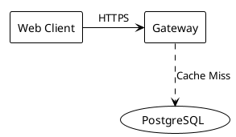

# FlexDiagram DSL Language Specification

**Version:** 1.1.0  
**Date:** September 5, 2026  
**File Extension:** `.diag`

---

## 1. Syntax Overview

FlexDiagram uses an intuitive, whitespace-tolerant declarative DSL for modeling graph structures, with built-in compatibility for standard PlantUML syntax constructs.

### 1.1 Node Shapes
Entities are declared using delimiter pairs corresponding to their visual shape:

| Syntax | Shape | Semantic Meaning |
| :--- | :--- | :--- |
| `[Name]` | **Rectangle** | General compute services, microservices, frontends, APIs |
| `(Name)` | **Cylinder** | Database instances, caches, object storage, persistence layers |
| `<Name>` | **Diamond** | Decision logic, branching routers, conditional filters |

*Rules:*
- Node names can contain spaces, numbers, and special characters (e.g. `[Auth Service v2.1]`, `(PostgreSQL DB)`).
- Delimiters may be escaped using backslashes (`\[`, `\]`, `\(`, `\)`).
- Node identity is normalized via deterministic slugification (e.g., `[Auth Service]` $\to$ `auth-service`).

---

### 1.2 Directed Edges, Connectors & Styles

FlexDiagram supports standard solid connections as well as dotted and dashed connector styles:

| Syntax | Type | Line Style | Description |
| :--- | :--- | :--- | :--- |
| `[A] -> [B]` | **Directed Arrow** | `solid` | Unidirectional solid relationship or primary data flow |
| `[A] --> [B]` | **Directed Arrow (Long)** | `solid` | Alternative arrow notation (equivalent to `->`) |
| `[A] ..> [B]` | **Dotted Arrow** | `dotted` | Secondary/async call, cache miss, or dependency injection |
| `[A] -.-> [B]` | **Dashed Arrow** | `dashed` | Event stream, webhook, or loose coupling |
| `[A] <-> [B]` | **Bidirectional** | `solid` | Mutual communication or synchronized replication |
| `[A] <..> [B]` | **Bidirectional Dotted** | `dotted` | Mutual loose coupling or broadcast peer connection |
| `[A] --- [B]` | **Undirected Link** | `solid` | Unoriented association or physical network link |
| `[A] ... [B]` | **Undirected Dotted** | `dotted` | Unoriented dashed/dotted association |

*Rendering:*
- `solid`: continuous line (`ctx.setLineDash([])`, SVG without `stroke-dasharray`).
- `dashed`: 6px dash, 4px gap (`ctx.setLineDash([6, 4])`, SVG `stroke-dasharray="6 4"`).
- `dotted`: 2px dot, 4px gap (`ctx.setLineDash([2, 4])`, SVG `stroke-dasharray="2 4"`).

---

### 1.3 Edge Labels
Descriptions may be attached to edges using a colon `:` delimiter:

```
[Client] -> [Gateway] : HTTPS Request
[Product Catalog Service] ..> (PostgreSQL Read Replica) : Cache Miss (SQL Read)
[Order Service] -> (Database) : SQL Transaction
```

*Rules:*
- Everything following the colon `:` on the line (excluding trailing comments) is captured as the label text.
- Edge labels are rendered inside translucent pill badges at the midpoint of the longest polyline segment.

---

### 1.4 Comments
FlexDiagram supports C-style comments as well as PlantUML single-quote comments:

```
// Single line comment
[Client] -> [Server] // Inline comment

/* Multi-line
   comment block */

' PlantUML single-quote comment line
[Server] -> (Database) ' Inline PlantUML comment
```

---

### 1.5 Edge Chaining
Multiple connections can be declared on a single statement:

```
[Client] -> [Gateway] -> [Auth Service]
```

This compiles into two distinct edges: `[Client] -> [Gateway]` and `[Gateway] -> [Auth Service]`.

---

### 1.6 PlantUML Compatibility Directives
To allow instant copy-pasting of existing architecture diagrams from PlantUML, FlexDiagram tolerates and silently filters PlantUML structural and styling directives:



Ignored directives include:
- `@startuml` and `@enduml`
- `!theme <name>`
- `skinparam <key> <value>`
- `title <title text>`
- `header <header text>` and `footer <footer text>`

---

## 2. Layout Metadata Format (`// @layout:v1`)

The trailing metadata block preserves manual position fine-tuning:

```
// @layout:v1
// {
//   "version": 1,
//   "nodes": {
//     "client": { "x": 100, "y": 150, "pinned": true },
//     "gateway": { "x": 350, "y": 150, "pinned": true }
//   },
//   "viewport": {
//     "panX": 60,
//     "panY": 60,
//     "zoom": 1.0
//   }
// }
```

- Keys are alphabetically sorted for minimal Git diffs.
- Pinned nodes are strictly preserved across AST reparses and code edits.

---

## 3. Visual Themes and Canvas Controls

### 3.1 Supported Color Themes

FlexDiagram supports both **Dark** and **Light (White)** themes across the user interface, interactive canvas, and graphic exports:

| Token | Dark Theme Palette | Light Theme Palette |
| :--- | :--- | :--- |
| `canvasBg` | `#0f1117` | `#ffffff` |
| `gridDot` | `rgba(255, 255, 255, 0.08)` | `rgba(0, 0, 0, 0.08)` |
| `nodeBg` | `#1a1d27` | `#f8fafc` |
| `nodeStroke` | `#2e3448` | `#cbd5e1` |
| `nodeCylinderCap` | `#222733` | `#e2e8f0` |
| `nodeSelectedStroke` | `#6366f1` | `#4f46e5` |
| `textPrimary` | `#e2e8f0` | `#0f172a` |
| `textSecondary` | `#94a3b8` | `#475569` |
| `edgeDefault` | `#64748b` | `#64748b` |
| `edgeSelected` | `#818cf8` | `#4f46e5` |

### 3.2 Viewport Navigation and Tool Modes

- **Pan Mode (`✋ Pan` / <kbd>H</kbd>):** Left-clicking and dragging anywhere on the canvas pans the viewport.
- **Select Mode (`↖ Select` / <kbd>V</kbd>):** Dragging on empty space draws a rectangular marquee selection box. Dragging nodes moves them.
- **Default Empty Space Pan:** Even in Select mode, clicking and dragging on empty canvas space pans the viewport smoothly.
- **Spacebar Pan:** Holding <kbd>Space</kbd> temporarily switches cursor to pan mode from any state.
- **Grid Toggle (`▦ Grid` / `⬚ Grid`):** Turns the background dot matrix on or off.
