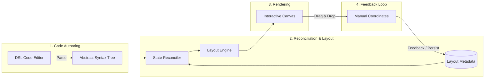
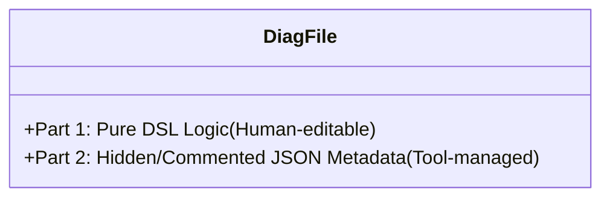
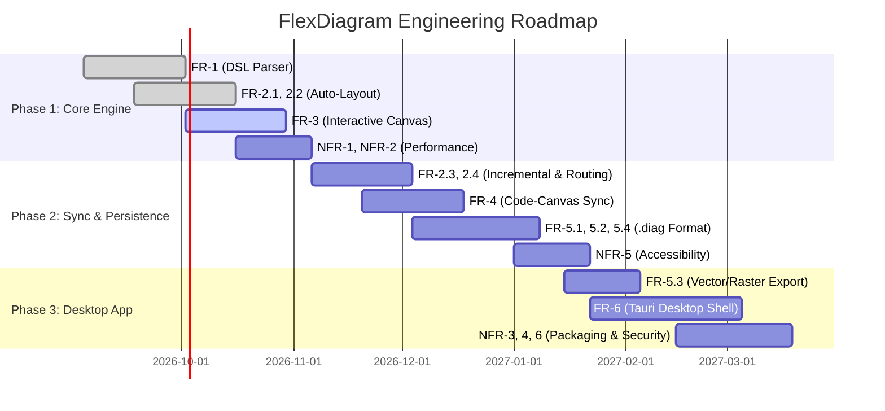

# FlexDiagram — User Requirements Document

**Project:** FlexDiagram (*Code first, Shape later*)  
**Document Version:** 1.0.0  
**Date:** September 4, 2026  
**Status:** Approved  
**Author:** FlexDiagram Core Architecture Team  

---

## Executive Summary & System Overview

FlexDiagram is a developer-centric visual diagramming platform built to eliminate the frustration of auto-layout diagram overlap. While declarative diagram tools (e.g., Mermaid, PlantUML) offer the speed of code-based authoring, their rigid layout engines often yield overlapping edges, awkward node clustering, and difficult-to-control topologies. FlexDiagram solves this dilemma with a **hybrid pipeline**: declarative text-first code authoring coupled with interactive, free-form canvas position adjustments.

### The 4-Step Closed Loop Pipeline



1. **DSL Code Editor → Parse → AST**: Text is parsed into an Abstract Syntax Tree (AST), assigning stable identity hashes to each node.
2. **AST → Merge with Override Metadata → Layout Engine**: The State Reconciler merges AST definitions with stored layout coordinates. Unpinned/new nodes are passed to the auto-layout engine, while pinned nodes maintain fixed coordinates.
3. **Layout Engine → Render → Interactive Canvas**: Nodes and routed edges are rendered onto a high-performance 60fps canvas.
4. **Canvas → Feedback Loop**: User manual repositioning assigns coordinates (`pinned: true`), persisting into the `.diag` file metadata section.

### Single File Architecture (`.diag`)

Diagrams are persisted as single-file, 100% Git-friendly text documents containing two synchronized zones:



```
[Client] -> [Gateway] : REST
[Gateway] -> [Auth Service] : gRPC
[Gateway] -> [Order Service] : gRPC
[Order Service] -> (Database)

<!-- flexdiagram:metadata
{
  "version": 1,
  "nodes": {
    "node_client": { "x": 120, "y": 80, "pinned": true },
    "node_gateway": { "x": 340, "y": 80, "pinned": true },
    "node_auth_service": { "x": 580, "y": 30, "pinned": false },
    "node_order_service": { "x": 580, "y": 140, "pinned": true },
    "node_database": { "x": 820, "y": 140, "pinned": false }
  }
}
-->
```

---

## 1. Functional Requirements

### Summary Matrix: Functional Requirements

| ID | Title / Sub-System | Priority | Phase | Summary |
| :--- | :--- | :--- | :--- | :--- |
| **FR-1** | **DSL Parser** | **Must** | **1** | Tokenize and parse DSL into AST with stable IDs and error reporting |
| **FR-2** | **Layout Engine** | **Must** | **1 & 2** | Sugiyama auto-layout, pinned node preservation, orthogonal edge routing |
| **FR-3** | **Interactive Canvas** | **Must** | **1** | 60fps canvas rendering, drag-and-drop repositioning, viewport navigation |
| **FR-4** | **Code-Canvas Synchronization** | **Must** | **1 & 2** | Bidirectional reactive syncing, debounced updates, node lifecycle sync |
| **FR-5** | **File Management** | **Must** | **2 & 3** | Git-compatible `.diag` format, load/save, and vector/raster exports |
| **FR-6** | **Desktop Application** | **Must** | **3** | Tauri v2 lightweight desktop shell, split-view UI, cross-platform support |

---

### FR-1: DSL Parser

The DSL parser converts declarative plain-text diagram definitions into a typed Abstract Syntax Tree (AST). It operates in memory, parsing code incrementally as the user types.

#### Requirements Table

| ID | Description | Priority | Phase |
| :--- | :--- | :--- | :--- |
| **FR-1.1** | Parse node definitions with square brackets `[NodeName]` as rectangle shapes | Must | 1 |
| **FR-1.2** | Parse node definitions with parentheses `(NodeName)` as cylinder / database shapes | Must | 1 |
| **FR-1.3** | Parse directed edge syntax `->` connecting source and target nodes | Must | 1 |
| **FR-1.4** | Parse edge labels declared using trailing `: label` syntax | Must | 1 |
| **FR-1.5** | Assign deterministic, stable unique IDs to each node derived from node label | Must | 1 |
| **FR-1.6** | Validate syntax and report error diagnostics including line number, column, and error description | Must | 1 |
| **FR-1.7** | PlantUML compatibility: tolerate and filter `@startuml`, `@enduml`, `!theme`, `skinparam`, and `'` single-quote comments | Should | 3 |
| **FR-1.8** | Dotted and dashed edge connectors: parse `..>`, `-.->`, `-->`, `<..>`, `...` into typed `EdgeStyle` | Should | 3 |

#### Detailed Specifications & Acceptance Criteria

- **FR-1.1 (Rectangle Nodes):**
  - **Syntax:** `[Label]`
  - **AST Output:** Node record with `shape: "rectangle"`, `name: "Label"`.
  - **Acceptance Criteria:** Leading/trailing whitespace inside brackets must be trimmed (e.g., `[ Client ]` produces name `"Client"`). Special characters inside quotes or standard alphanumeric strings with spaces must be preserved.
- **FR-1.2 (Cylinder / Database Nodes):**
  - **Syntax:** `(Label)`
  - **AST Output:** Node record with `shape: "cylinder"`, `name: "Label"`.
  - **Acceptance Criteria:** Cylinder nodes must be clearly distinguished in the AST from rectangle nodes.
- **FR-1.3 (Directed Edges):**
  - **Syntax:** `[Source] -> [Target]` or `[Source] -> (Target)`
  - **AST Output:** Edge record with `sourceId`, `targetId`, and `directed: true`.
  - **Acceptance Criteria:** If a node appears in an edge expression without prior standalone declaration, the parser must implicitly declare the node using the enclosing shape delimiter.
- **FR-1.4 (Edge Labels):**
  - **Syntax:** `[Source] -> [Target] : Edge Description`
  - **AST Output:** Edge record populated with `label: "Edge Description"`.
  - **Acceptance Criteria:** Colons inside quoted strings must not trigger false label parsing. Labels may include alphanumeric characters, punctuation, and spaces.
- **FR-1.5 (Stable Node IDs):**
  - **Mechanism:** Generate normalized identifiers based on node label (e.g., slugify or canonical hash: `"Order Service"` → `node_order_service`).
  - **Acceptance Criteria:** Changing the order of lines in the DSL must not change the generated node IDs. Node IDs must remain invariant across restarts for identical node names.
- **FR-1.6 (Syntax Diagnostics):**
  - **Output:** Structured diagnostic objects: `{ line: number, column: number, message: string, severity: "error" | "warning" }`.
  - **Acceptance Criteria:** Unterminated brackets (e.g., `[Client -> [Server]`), invalid tokens, or malformed arrows must yield clear error markers with exact 1-based line numbers. Valid portions of the document should parse gracefully if possible (error tolerance).
- **FR-1.7 (PlantUML Syntax Tolerance):**
  - **Syntax:** `@startuml`, `@enduml`, `!theme <theme>`, `skinparam <key> <value>`, and `' comment`
  - **AST Output:** Statements are cleanly filtered out without syntax errors or spurious node/edge creation.
  - **Acceptance Criteria:** Copying and pasting standard PlantUML code blocks with skins and comments compiles cleanly without throwing parser errors.
- **FR-1.8 (Dotted & Dashed Connectors):**
  - **Syntax:** `[A] ..> [B]`, `[A] -.-> [B]`, `[A] --> [B]`, `[A] <..> [B]`, `[A] ... [B]`
  - **AST Output:** Edge record with `style: "dotted" | "dashed" | "solid"`.
  - **Acceptance Criteria:** Parsed style tags must be passed to the layout and rendering pipeline for line dash styling.

---

### FR-2: Layout Engine

The Layout Engine calculates two-dimensional coordinates $(x, y)$ for nodes and polyline paths for edges, bridging declarative topology with spatial geometry.

#### Requirements Table

| ID | Description | Priority | Phase |
| :--- | :--- | :--- | :--- |
| **FR-2.1** | Auto-layout new and unpinned nodes using the Dagre (Sugiyama layered graph) algorithm | Must | 1 |
| **FR-2.2** | Respect fixed coordinates of pinned nodes (`pinned: true`) during layout execution | Must | 1 |
| **FR-2.3** | Incremental layout — introducing new nodes or edges must preserve positions of existing pinned nodes | Must | 2 |
| **FR-2.4** | Calculate orthogonal edge paths (horizontal and vertical segments) that avoid crossing node bodies | Must | 2 |
| **FR-2.5** | Robustly handle edge cases: isolated nodes, self-referencing loops, and bidirectional edges | Should | 1 |

#### Detailed Specifications & Acceptance Criteria

- **FR-2.1 (Auto-Layout Algorithm):**
  - Uses hierarchical Sugiyama layout (Dagre engine) to rank nodes into layers and minimize edge crossings.
  - Computes default dimensions (e.g., $140 \times 60\,\text{px}$ for rectangles, $120 \times 70\,\text{px}$ for cylinders) with configurable layer and node separation.
- **FR-2.2 (Pinned Node Enforcement):**
  - If a node exists in the layout metadata with `{ "pinned": true, "x": N, "y": M }`, the layout engine must lock its bounding box to $(N, M)$.
  - Constraints must prevent auto-layout from shifting locked nodes.
- **FR-2.3 (Incremental Layout Stability):**
  - When the user appends a new node (e.g., `[Payment Service]`) to an existing 10-node diagram where 8 nodes are pinned, the 8 pinned nodes must not shift by even a single pixel.
  - The new unpinned node must be placed into the nearest available open whitespace that minimizes edge distance without overlapping existing nodes.
- **FR-2.4 (Orthogonal Edge Routing):**
  - Edges must be routed as Manhattan / orthogonal polylines consisting strictly of horizontal and vertical line segments.
  - The router must maintain an obstruction grid of all node bounding boxes (plus an $8\,\text{px}$ safety margin) and route around node bodies using an A* grid router or visibility graph algorithm.
- **FR-2.5 (Topological Edge Cases):**
  - **Isolated Nodes:** Nodes without edges must be positioned neatly in a designated perimeter tier or top grid rather than colliding at $(0,0)$.
  - **Self-Loops:** A node connected to itself (`[A] -> [A] : retry`) must render as an outward orthogonal loop around the node perimeter.
  - **Bidirectional Edges:** Edges `[A] -> [B]` and `[B] -> [A]` must route with adequate parallel offset to prevent label and line collisions.

---

### FR-3: Interactive Canvas

The interactive canvas provides the graphical manipulation interface, rendering the diagram at high framerates and supporting direct spatial interactions.

#### Requirements Table

| ID | Description | Priority | Phase |
| :--- | :--- | :--- | :--- |
| **FR-3.1** | Render rectangle and cylinder nodes with readable typography, centered text, and custom visual styling | Must | 1 |
| **FR-3.2** | Render directed edge lines with directional arrowheads and centered text labels | Must | 1 |
| **FR-3.3** | Direct drag-and-drop manipulation allowing users to freely reposition any node on the $(x, y)$ plane | Must | 1 |
| **FR-3.4** | Infinite pan via canvas drag / middle-click / trackpad scroll, and zoom via mouse scroll wheel or pinch gestures | Must | 1 |
| **FR-3.5** | Automatically mark a node as `pinned: true` immediately upon manual drag-and-drop movement | Must | 1 |
| **FR-3.6** | Provide distinct visual feedback indicating whether a node is pinned (manual position) or unpinned (auto-layout) | Must | 1 |
| **FR-3.7** | Intuitive canvas panning by clicking and holding left mouse on empty canvas, with HUD mode switcher (`Pan` / `Select`) and hotkeys (`H`, `V`, `Space`) | Must | 3 |
| **FR-3.8** | Canvas background dot grid visibility toggle control | Should | 3 |

#### Detailed Specifications & Acceptance Criteria

- **FR-3.1 (Node Visual Rendering):**
  - Rectangles rendered with subtle corner radiuses ($4\text{--}6\,\text{px}$), clean borders, and clear typography.
  - Cylinder/database nodes rendered with an elliptical top cap and curved base.
  - Text must wrap or truncate with ellipsis if exceeding node boundaries.
- **FR-3.2 (Edge & Arrow Rendering):**
  - Edges rendered as crisp vector lines ($1.5\text{--}2\,\text{px}$ stroke) with support for solid, dashed, and dotted styles.
  - Arrowheads rendered at target attachment ports, pointing towards target nodes.
  - Labels rendered with high-contrast background pills or bounding boxes to ensure readability against background grid or crossing lines.
- **FR-3.3 (Drag-and-Drop Interaction):**
  - Mouse down on a node initiates dragging; node coordinates update in real time with the pointer.
  - Connected edge endpoints dynamically re-anchor and recalculate during the drag operation.
  - Multi-selection drag must be supported in subsequent phase polish.
- **FR-3.4 (Viewport Pan and Zoom):**
  - Pan: Drag canvas background or scroll with trackpad across an infinite coordinate space.
  - Zoom: Scale viewport from $10\%$ to $400\%$ centered on mouse cursor position. Zoom level indicator displayed on canvas overlay.
- **FR-3.5 (Implicit Auto-Pinning):**
  - When the user releases a dragged node (`mouseUp`), its state transitions from `pinned: false` to `pinned: true`, and its final $(x, y)$ is committed to metadata.
  - An optional context menu allows toggling "Unpin / Reset to Auto-layout".
- **FR-3.6 (Pin State Visual Cues):**
  - Pinned nodes display a subtle pin badge icon or distinct border highlight (e.g., solid accent border or anchor icon in the corner).
  - Unpinned nodes display a softer, dashed, or neutral border, signaling that they will dynamically shift if new upstream nodes are introduced.
- **FR-3.7 (Intuitive Panning & Tool Modes):**
  - Left-clicking and dragging on empty canvas area initiates smooth viewport panning without requiring spacebar or middle mouse.
  - A persistent HUD toggle allows switching between `✋ Pan` mode and `↖ Select` mode, bound to hotkeys `H` and `V`.
  - Holding `Space` activates temporary pan mode from any tool state.
- **FR-3.8 (Grid Visibility Toggle):**
  - A toggle button in both the header toolbar and floating HUD turns the background dot grid on or off without affecting diagram coordinates.

---

### FR-4: Code-Canvas Synchronization

The bi-directional synchronization subsystem maintains consistency between text DSL code, runtime AST, in-memory layout metadata, and canvas elements.

#### Requirements Table

| ID | Description | Priority | Phase |
| :--- | :--- | :--- | :--- |
| **FR-4.1** | Synchronize DSL editor modifications to canvas rendering within 200ms latency | Must | 1 |
| **FR-4.2** | Reflect canvas drag updates immediately in layout metadata without dirtying DSL logic | Must | 2 |
| **FR-4.3** | Cleanly remove deleted DSL nodes from both canvas display and persistent layout metadata | Must | 2 |
| **FR-4.4** | Preserve manual spatial positions when a node is renamed in code if correspondence is detectable | Should | 2 |

#### Detailed Specifications & Acceptance Criteria

- **FR-4.1 (Reactive Code-to-Canvas Sync):**
  - Keypresses in the code editor trigger an incremental parse debounced to $\le 150\,\text{ms}$.
  - Total latency from last keystroke to updated canvas render must not exceed $200\,\text{ms}$.
  - If a syntax error is introduced, the canvas must retain its previous valid state while displaying a non-intrusive error banner.
- **FR-4.2 (Canvas-to-Metadata Sync):**
  - Dragging a node updates the in-memory metadata store immediately.
  - Does not modify or reformat the user's DSL code block, preserving comments, blank lines, and text formatting.
  - Debounces serialization back into the comment metadata block on file save.
- **FR-4.3 (Node Deletion Cleanup):**
  - When a user deletes a node (e.g., deletes `[Auth Service]` from DSL), the State Reconciler identifies the missing node ID.
  - The node and all connected edges are removed from the canvas scene graph.
  - The orphaned entry in the metadata block is pruned upon save.
- **FR-4.4 (Rename Heuristics):**
  - If an existing node `[OldName]` is replaced by `[NewName]` in the same line/position in AST diff, or if the user performs an editor rename action, transfer the `(x, y, pinned)` coordinates of `OldName` to `NewName`.
  - If ambiguity exists, assign default unpinned layout without crashing or losing unaffected nodes.

---

### FR-5: File Management

The file management subsystem manages file persistence, serialization, deserialization, and multi-format asset exports.

#### Requirements Table

| ID | Description | Priority | Phase |
| :--- | :--- | :--- | :--- |
| **FR-5.1** | Save diagrams into `.diag` unified format (clean DSL + JSON metadata enclosed in comment tags) | Must | 2 |
| **FR-5.2** | Parse and load `.diag` files, restoring textual DSL to the editor and layout positions to the canvas | Must | 2 |
| **FR-5.3** | Export diagram canvas to PNG (raster), SVG (scalable vector), and PDF formats | Should | 3 |
| **FR-5.4** | Guarantee `.diag` format is 100% human-readable, deterministic, and Git diff-friendly | Must | 2 |

#### Detailed Specifications & Acceptance Criteria

- **FR-5.1 (Single-File Persistence):**
  - File extension: `.diag`.
  - Format structure: Top section contains raw UTF-8 DSL code. Bottom section contains JSON metadata enclosed inside `<!-- flexdiagram:metadata ... -->`.
  - Metadata schema:
    ```json
    <!-- flexdiagram:metadata
    {
      "version": 1,
      "viewport": { "zoom": 1.0, "panX": 0, "panY": 0 },
      "nodes": {
        "node_id": { "x": 100, "y": 200, "pinned": true }
      }
    }
    -->
    ```
- **FR-5.2 (File Ingestion):**
  - On file open, split text on the metadata delimiter.
  - If metadata block is missing (e.g., user wrote a raw `.diag` file in Vim or VS Code), run full auto-layout (FR-2.1) without error.
  - Restore viewport zoom and pan position if present.
- **FR-5.3 (Multi-Format Export):**
  - **SVG:** Clean vector output preserving shapes, text elements, and stroke styles. Independent of device pixel ratio.
  - **PNG:** High-resolution raster rendering with selectable scale factors ($1\times, 2\times, 4\times$ for retina display prints).
  - **PDF:** Vector-embedded single-page document cropped to diagram bounding box with $20\,\text{px}$ margin.
- **FR-5.4 (Git Diff Friendliness):**
  - Node metadata keys in JSON must be sorted alphabetically.
  - Floats rounded to 2 decimal places to avoid micro-float diff noise.
  - Modifying text logic produces clean diffs at top of file; moving nodes produces clean one-line diffs in JSON section.

---

### FR-6: Desktop Application

The desktop application wraps the core engine in a native, cross-platform container using Tauri v2.

#### Requirements Table

| ID | Description | Priority | Phase |
| :--- | :--- | :--- | :--- |
| **FR-6.1** | Split-view workspace featuring resizable panels for code editor and visual canvas | Must | 3 |
| **FR-6.2** | Native desktop executables and installers for Windows (x64/arm64), macOS (Apple Silicon/Intel), and Linux (AppImage/deb) | Must | 3 |
| **FR-6.3** | Ultra-lean footprint: Installer package size $< 15\,\text{MB}$ and idle runtime memory $< 60\,\text{MB}$ | Must | 3 |
| **FR-6.4** | Dark and Light (White) theme support across application UI, canvas renderer, and graphic exports | Must | 3 |
| **FR-6.5** | High-fidelity theme-aware geometric rendering (including cylinder cap depth and node contrast) | Should | 3 |

#### Detailed Specifications & Acceptance Criteria

- **FR-6.1 (Split-View Workspace):**
  - Left panel: Code editor (Monaco or CodeMirror 6) with syntax highlighting, line numbers, and error squiggles.
  - Right panel: Interactive graphical canvas.
  - Central splitter bar: Draggable with double-click auto-centering (50/50, 30/70, 70/30 presets) or collapsible to canvas-only / code-only mode.
- **FR-6.2 (Cross-Platform Packaging):**
  - Powered by Tauri v2 with Rust backend and native OS webview (WebKit on macOS, WebView2 on Windows, WebKitGTK on Linux).
  - Native file dialogs for Open, Save As, and Export.
  - Auto-update capability and OS system menu integration.
- **FR-6.3 (Lightweight Footprint):**
  - Packaged desktop installer size must not exceed $15\,\text{MB}$ (compared to typical Electron $80\text{--}150\,\text{MB}$).
  - Resident Set Size (RSS) memory consumption on startup must stay below $60\,\text{MB}$.
- **FR-6.4 (Dark and Light Themes):**
  - Instant theme switching without diagram re-parse or canvas flicker.
  - White theme provides `#ffffff` canvas with dark text and crisp contrast for presentation slides.
  - Vector SVG and raster PNG exports inherit the active theme colors.
- **FR-6.5 (Theme-Aware Geometric Rendering):**
  - Dedicated tokens like `nodeCylinderCap` prevent visual artifacting (such as black cylinder caps on white backgrounds) by adapting to palette background shades.

---

## 2. Non-Functional Requirements

### Summary Table: Non-Functional Requirements

| ID | Category | Requirement Description | Quantitative Target | Priority | Phase |
| :--- | :--- | :--- | :--- | :--- | :--- |
| **NFR-1** | **Performance** | Smooth canvas rendering during pan and zoom interactions | Maintain $\ge 60\,\text{fps}$ with up to 500 nodes and 750 edges | Must | 1 |
| **NFR-2** | **Performance** | End-to-end latency from code editing to canvas visual update | $\le 200\,\text{ms}$ debounce & render cycle | Must | 1 |
| **NFR-3** | **Startup Time** | Application launch to interactive workspace ready | $< 2.0\,\text{seconds}$ on standard mid-range hardware | Must | 3 |
| **NFR-4** | **Resource Usage** | Application runtime memory footprint | $< 60\,\text{MB}$ RAM at idle state | Must | 3 |
| **NFR-5** | **Accessibility** | Canvas navigation and selection operable without pointing devices | Full keyboard shortcuts for node traversal, panning, and zoom | Should | 2 |
| **NFR-6** | **Security** | Sandboxed desktop execution and strict filesystem scoping | Tauri v2 least-privilege security capabilities & CSP | Must | 3 |

---

### Detailed Non-Functional Specifications

#### NFR-1: Performance (Canvas Framerate)
- **Description:** The rendering pipeline must prevent frame drops, stuttering, and input lag during high-frequency user interactions.
- **Quantitative Target:**
  - Maintain a constant $60\,\text{fps}$ (frame budget $\le 16.6\,\text{ms}$) during active panning, zooming, and node dragging.
  - Benchmark scenario: Complex graph of 500 nodes and 750 directed edges on a 1080p canvas.
- **Verification Method:** Automated continuous performance test recording frame render times via `requestAnimationFrame` metrics and Chrome DevTools Trace / Webview Performance Profiler.

#### NFR-2: Performance (Code-to-Canvas Latency)
- **Description:** Real-time feedback between text editor keystrokes and visual layout rendering must feel instantaneous.
- **Quantitative Target:**
  - Keydown event $\rightarrow$ incremental parse $\rightarrow$ AST update $\rightarrow$ reconciliation $\rightarrow$ layout computation $\rightarrow$ DOM/Canvas paint completed within $< 200\,\text{ms}$.
- **Verification Method:** High-precision timestamp logging (`performance.now()`) from text editor `onDidChangeModelContent` to canvas draw completion callback.

#### NFR-3: Startup Time
- **Description:** Fast cold start enabling developers to quickly open diagrams as an everyday desktop utility.
- **Quantitative Target:**
  - Total elapsed time from clicking application icon to fully rendered split-view UI ready for user input $< 2.0\,\text{seconds}$ on reference mid-range hardware (e.g., Quad-Core x86_64, 8GB RAM, SSD).
- **Verification Method:** Process invocation benchmarking measuring cold start to primary window `DOMContentLoaded` and initial canvas frame paint.

#### NFR-4: Memory Efficiency
- **Description:** FlexDiagram must remain ultra-lightweight, enabling it to run continuously in the background alongside heavy IDEs (e.g., VS Code, IntelliJ).
- **Quantitative Target:**
  - Idle RSS memory consumption must not exceed $60\,\text{MB}$ RAM after initial launch.
  - Active editing of a 200-node diagram must not exceed $120\,\text{MB}$ RAM without memory leaks over 2 hours of continuous usage.
- **Verification Method:** Memory profiling using OS process monitors (`ps`, `top`, Activity Monitor) and heap snapshot validation.

#### NFR-5: Accessibility & Keyboard Navigation
- **Description:** Power users and developers who prefer keyboard interaction must be able to navigate and operate the canvas without continuous mouse reliance.
- **Quantitative Target:**
  - Tab / Shift+Tab cycles selection through graph nodes in topological or positional order.
  - Arrow keys pan viewport; `Ctrl/Cmd + '+'` and `Ctrl/Cmd + '-'` zoom in and out.
  - `Ctrl/Cmd + Arrow Keys` nudge selected pinned nodes by $10\,\text{px}$ grid intervals.
  - Screen-reader accessible node labels and ARIA attributes for UI components.
- **Verification Method:** Keyboard-only usability audit and automated synthetic keyboard event test suites.

#### NFR-6: Security & Permissions
- **Description:** The desktop application must adhere to defense-in-depth principles, safeguarding the user's host environment.
- **Quantitative Target:**
  - Tauri v2 application permissions restricted to explicit filesystem scopes (user-selected directories for `.diag` loading and saving).
  - Strict Content Security Policy (CSP): `default-src 'self'`; zero remote code execution; disabled arbitrary shell command execution.
  - Local file reading isolated from network access (no external telemetry or unauthorized outbound calls).
- **Verification Method:** Tauri security audit tools, CSP validator, and network packet capture during operation.

---

## 3. Requirements Traceability & Phase Roadmap

The 3-phase roadmap structures deliverable scope from core algorithmic foundations to a polished cross-platform desktop application:



### Phase Mapping Breakdown

| Phase | Focus Area | Functional Requirements Included | Non-Functional Requirements Included | Target Deliverable |
| :--- | :--- | :--- | :--- | :--- |
| **Phase 1** | **Core Engine (CLI/Web)** | FR-1.1, FR-1.2, FR-1.3, FR-1.4, FR-1.5, FR-1.6, FR-2.1, FR-2.2, FR-2.5, FR-3.1, FR-3.2, FR-3.3, FR-3.4, FR-3.5, FR-3.6 | NFR-1 (60fps), NFR-2 (<200ms latency) | In-browser prototype & web sandbox with AST parser, Dagre layout, and draggable canvas |
| **Phase 2** | **Sync & Persistence** | FR-2.3, FR-2.4, FR-4.1, FR-4.2, FR-4.3, FR-4.4, FR-5.1, FR-5.2, FR-5.4 | NFR-5 (Keyboard accessibility) | Bidirectional live synchronization engine, incremental auto-layout, orthogonal router, `.diag` file serializer |
| **Phase 3** | **Cross-Platform App** | FR-5.3, FR-6.1, FR-6.2, FR-6.3 | NFR-3 (<2s startup), NFR-4 (<60MB RAM), NFR-6 (Tauri security sandbox) | Production-ready native Tauri v2 desktop app (macOS, Linux, Windows) with split-view and export suite |

---

## 4. Glossary of Terms

- **AST (Abstract Syntax Tree):** In-memory structured representation of the parsed DSL code elements.
- **Auto-Pinning:** The automatic assignment of `pinned: true` status to a node once a user manually drags it to a custom location.
- **Dagre:** A JavaScript library for directed graph layout using Sugiyama-style hierarchical rank assignment.
- **Orthogonal Edge Routing:** Edge pathing constrained to 90-degree right angles that circumnavigates node collision boxes.
- **Reconciliation:** The process of reconciling the freshly parsed AST with the persistent layout metadata table to determine whether each node should undergo auto-layout or preserve manual coordinates.
- **Stable ID:** A deterministic, unique identifier generated for each diagram node based on its canonical name, ensuring positions persist across file reloads and layout passes.
