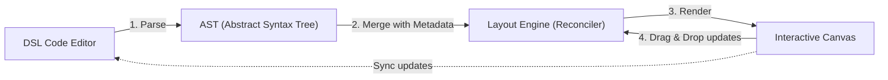

# FlexDiagram: User Stories & Requirements Specification

**Document Version:** 1.0.0  
**Effective Date:** September 4, 2026  
**Status:** Approved  
**Project:** FlexDiagram (*Code first, Shape later*)

---

## 1. Overview & Context

FlexDiagram resolves the core frustration of automated diagramming tools (such as PlantUML or Mermaid): rigid auto-layout engines frequently produce tangled, overlapping edges and awkward node placements, while traditional visual tools (such as Visio or Miro) lack code-driven maintainability and version-control discipline. 

FlexDiagram combines the rapid authoring of a simple text DSL with free-form visual manipulation on an interactive canvas through a **4-step closed-loop pipeline**:



### Priority Definitions

| Priority | Level | Description | Target Phase |
| :--- | :--- | :--- | :--- |
| **P0** | Must-Have | Core critical-path functionality essential for a viable MVP. Without these, the application cannot demonstrate its core value proposition. | Phase 1: Core Engine |
| **P1** | Important | High-value capabilities that deliver complete workflows, persistence, and production utility. | Phase 2: Sync & Persistence / Phase 3: Desktop App |
| **P2** | Nice-to-Have | Ergonomic enhancements, layout polish, and workflow accelerators that refine user experience. | Phase 3: Desktop App / Post-MVP |

---

## 2. User Roles & Personas

- **Software Architect (Primary):** Needs to quickly sketch distributed architectures, microservices, and system boundaries in code, then fine-tune visual arrangement for executive presentations without losing Git history.
- **Backend / Systems Engineer:** Prefers keyboard-first workflow, automated edge routing, and clean version-control diffs when documenting API flows and database topologies.
- **Technical Writer / Documentation Specialist:** Requires fast export of high-fidelity vector diagrams (SVG/PDF/PNG) and predictable layout rendering across operating systems.

---

## 3. Epics & User Stories

### Epic 1: DSL Code Editing

Focuses on the text-based authoring experience, AST parsing, error diagnostics, and reactive editor-to-canvas rendering.

---

#### US-1.1: Text-Based DSL Diagram Authoring
- **User Story:** As a Software Architect, I want to define system nodes, shapes, and labeled relationships using a clean, human-readable DSL, so that I can draft complex system architectures in seconds without touching the mouse.
- **Priority:** `P0`
- **Target Phase:** Phase 1 (Core Engine)

##### Acceptance Criteria
1. The parser must recognize rectangular nodes declared using square brackets: `[Node Name]`.
2. The parser must recognize database/storage nodes declared using parentheses: `(Database Name)`.
3. The parser must support directed connections using the `->` operator (e.g., `[Client] -> [Gateway]`).
4. The parser must support relationship labels declared with a colon syntax: `[Client] -> [Gateway] : REST`.
5. Each unique node identifier string must be assigned a deterministic, collision-free `Stable ID`.
6. Comments prefixed with `//` or `#` must be ignored during AST generation.

---

#### US-1.2: Syntax Highlighting and Diagnostic Error Feedback
- **User Story:** As a Developer, I want real-time syntax highlighting and inline diagnostic error markers in the code editor, so that I can immediately detect and fix syntax mistakes before compiling the diagram.
- **Priority:** `P0`
- **Target Phase:** Phase 1 (Core Engine)

##### Acceptance Criteria
1. The editor must tokenize and highlight keywords, bracket delimiters (`[]`, `()`), relationship arrows (`->`), and edge labels with distinct color tokens.
2. When invalid syntax is entered (e.g., unclosed bracket `[Unclosed Node`, malformed edge syntax `[A] -- [B]`), the editor must display an inline red squiggle at the exact character offset.
3. Hovering over the error indicator must display a human-readable explanation and suggested correction.
4. Parsing errors must gracefully fail safe: the interactive canvas must preserve the last valid rendered state and present a non-blocking warning banner rather than crashing or clearing the screen.

---

#### US-1.3: Real-Time Live Preview Synchronization
- **User Story:** As an Author, I want the visual canvas to re-render in real-time as I type in the DSL editor, so that I immediately see the graphical representation of my structural changes.
- **Priority:** `P0`
- **Target Phase:** Phase 1 (Core Engine)

##### Acceptance Criteria
1. DSL changes must trigger canvas updates within a debounced window of $\le 150\text{ ms}$ after keystroke idle.
2. The canvas rendering lifecycle must maintain 60 fps without UI freeze or stutter during typing on diagrams with up to 100 nodes.
3. If the user is actively dragging an element on the canvas while an external editor event occurs, canvas interaction must retain priority to prevent input drops.

---

#### US-1.4: PlantUML Syntax Compatibility & Rich Edge Styling
- **User Story:** As an Architect migrating existing documentation, I want to paste PlantUML code directly into FlexDiagram without syntax errors, so that I can immediately visualize and fine-tune legacy diagrams.
- **Priority:** `P1`
- **Target Phase:** Phase 3 (Cross-platform App)

##### Acceptance Criteria
1. The parser must recognize and ignore PlantUML wrapper directives: `@startuml`, `@enduml`, `!theme`, `skinparam`, `title`, `header`, `footer`.
2. The lexer must support PlantUML single-quote comments (`' ...`) both as full lines and trailing comments.
3. The parser must support alternative arrow formats (`-->`) as well as dotted and dashed arrow connectors (`..>`, `-.->`, `<..>`, `...`).
4. Line styles (`solid`, `dashed`, `dotted`) must be passed to the renderer and rendered with appropriate canvas dash patterns and SVG stroke dash arrays.

---

### Epic 2: Auto Layout

Focuses on automated geometric node distribution, non-overlapping constraints, and smart orthogonal line routing.

---

#### US-2.1: Non-Overlapping Auto-Layout for New Nodes
- **User Story:** As an Author, I want new nodes declared in DSL to be automatically positioned on the canvas without overlapping existing elements, so that I do not have to manually arrange every node from scratch.
- **Priority:** `P0`
- **Target Phase:** Phase 1 (Core Engine)

##### Acceptance Criteria
1. Initial layout generation must arrange nodes hierarchically or structurally using Sugiyama-style layered layout (Dagre) or constraint force layout (WebCola).
2. The layout algorithm must enforce a minimum clearance boundary:
   - Node-to-node horizontal gap $\ge 50\text{ px}$.
   - Node-to-node vertical rank separation $\ge 70\text{ px}$.
3. Zero node bounding-box collisions: no two node bounding boxes may overlap in the generated layout.
4. Node labels must fit comfortably within node boundaries with minimum $8\text{ px}$ internal padding.

---

#### US-2.2: Orthogonal Edge Routing Around Node Obstacles
- **User Story:** As a Systems Engineer, I want connection lines and arrows to automatically route around node bodies using orthogonal (right-angled) paths, so that lines do not cut illegibly through other nodes.
- **Priority:** `P1`
- **Target Phase:** Phase 2 (Sync & Persistence)

##### Acceptance Criteria
1. Directed edges must calculate orthogonal paths consisting of horizontal and vertical segments connected by right-angle bends (or chamfered/rounded corners).
2. The edge router must treat all node bounding boxes (with a $10\text{ px}$ buffer) as obstacles and pathfind around them.
3. Edge labels must be placed at the midpoint of the longest segment or adjacent to the directional arrow without overlapping edge lines or node shapes.
4. When two edges intersect, routing must maintain visual clarity (e.g., using subtle bridge jumps or distinct routing channels).

---

#### US-2.3: Incremental Auto-Layout Without Disrupting Existing Nodes
- **User Story:** As an Architect, I want to add new nodes to an existing diagram without the auto-layout engine reshuffling my previously positioned nodes, so that my visual mental map is preserved.
- **Priority:** `P1`
- **Target Phase:** Phase 2 (Sync & Persistence)

##### Acceptance Criteria
1. When a new node is parsed from the DSL, the State Reconciler must identify all existing positioned/pinned nodes and preserve their exact $(x, y)$ coordinates.
2. The layout engine must execute an incremental placement step that inserts new nodes into the nearest viable unoccupied canvas space adjacent to their connected neighbors.
3. Connected edges linked to existing nodes must update their route to the new node without altering unaffected graph regions.

---

### Epic 3: Canvas Interaction

Focuses on direct physical manipulation of the diagram: pan, zoom, drag-and-drop, selection, and visual alignment guides.

---

#### US-3.1: Free-Form Node Drag and Repositioning
- **User Story:** As an Architect, I want to drag any node to any arbitrary position on the canvas, so that I can override imperfect auto-layout decisions and place components exactly where they make visual sense.
- **Priority:** `P0`
- **Target Phase:** Phase 1 (Core Engine)

##### Acceptance Criteria
1. Clicking and dragging a node must immediately move that node across the canvas under the cursor with sub-millisecond response and zero noticeable lag.
2. While moving a node, all incoming and outgoing edges connected to that node must dynamically recompute their anchor points and terminal paths in real time.
3. Releasing the node must drop it at the final cursor coordinates and commit its new $(x, y)$ position.
4. Dragging a node must automatically mark its layout status as `pinned: true`.

---

#### US-3.2: High-Performance Pan and Zoom
- **User Story:** As an Author, I want to smoothly pan across and zoom into large diagrams, so that I can inspect high-level system context as well as granular component details.
- **Priority:** `P0`
- **Target Phase:** Phase 1 (Core Engine)

##### Acceptance Criteria
1. The canvas must support smooth zooming via mouse wheel / trackpad pinch gestures between a minimum scale of $10\%$ ($0.1\times$) and a maximum scale of $400\%$ ($4.0\times$).
2. Zooming must zoom toward the current mouse pointer coordinate anchor.
3. The canvas must support panning via:
   - Middle-mouse button drag.
   - Spacebar + Left-click drag.
   - Two-finger trackpad drag.
4. Canvas transformations must maintain steady 60 fps rendering on 4K displays using hardware-accelerated 2D Canvas or PixiJS.

---

#### US-3.3: Multi-Node Selection and Batch Movement
- **User Story:** As a Developer, I want to select multiple nodes simultaneously and move them as a group, so that I can reorganize entire subsystems without moving nodes one by one.
- **Priority:** `P1`
- **Target Phase:** Phase 2 (Sync & Persistence)

##### Acceptance Criteria
1. The user can perform rubber-band box selection (marquee selection) by dragging the cursor across empty canvas areas.
2. The user can toggle individual node selection by holding `Shift` or `Cmd/Ctrl` while clicking nodes.
3. Selected nodes must display an active multi-selection bounding box with distinct highlight borders.
4. Dragging any node within the selection group must translate all selected nodes together, maintaining their exact relative offsets.
5. Dropping a selected group must update and pin coordinates for all relocated nodes in batch.

---

#### US-3.4: Magnetic Snap Guides and Visual Alignment
- **User Story:** As a Design-Conscious Architect, I want visual alignment snap lines to appear when dragging nodes near other nodes, so that I can easily align shapes horizontally and vertically.
- **Priority:** `P2`
- **Target Phase:** Phase 3 (Desktop App)

##### Acceptance Criteria
1. When a dragged node's edge or center aligns within a $5\text{ px}$ threshold of an adjacent node's edge or center, it must snap magnetically to that axis.
2. A subtle colored guideline (e.g., cyan dashed line) must temporarily render across the canvas indicating the active alignment axis (Left, Center, Right, Top, Middle, Bottom).
3. Holding `Alt` or `Option` while dragging must temporarily disable magnetic snapping for micro-positioning.

---

#### US-3.5: Intuitive Click-and-Hold Canvas Panning & Mode Switcher
- **User Story:** As an Architect exploring large diagrams, I want to pan the canvas simply by clicking and holding the left mouse button, so that navigating feels effortless without memorizing complex modifier keys.
- **Priority:** `P1`
- **Target Phase:** Phase 3 (Desktop App)

##### Acceptance Criteria
1. Left-clicking and dragging on any empty canvas area must immediately pan the viewport.
2. A floating HUD must provide a mode switcher between `✋ Pan` mode and `↖ Select` mode.
3. In Pan mode, dragging anywhere pans the viewport. In Select mode, dragging on empty space triggers marquee selection.
4. Keyboard shortcuts <kbd>H</kbd> (Hand/Pan), <kbd>V</kbd> (Select), and holding <kbd>Space</kbd> (Temporary pan) must be supported.

---

#### US-3.6: Canvas Dot Grid Display Toggle
- **User Story:** As a Presenter, I want to toggle the background dot matrix grid on or off, so that I can capture clean presentations or focus purely on diagram shapes.
- **Priority:** `P2`
- **Target Phase:** Phase 3 (Desktop App)

##### Acceptance Criteria
1. A toggle button in both the header bar and floating HUD must show/hide background dot grid markers.
2. Grid toggle state must immediately re-render canvas without shifting node coordinates or zoom.

---

### Epic 4: Pin & Sync Mechanism

Focuses on the state reconciliation between manual visual adjustments and automated layout calculations, ensuring seamless bidirectional flow.

---

#### US-4.1: Explicit Node Pinning
- **User Story:** As an Author, I want to explicitly pin a node's canvas position, so that subsequent layout recalculations or DSL changes never shift it from its established location.
- **Priority:** `P0`
- **Target Phase:** Phase 1 (Core Engine)

##### Acceptance Criteria
1. Whenever a node is manually moved by the user, its metadata record must set `pinned: true` along with its exact coordinates `{ x: number, y: number }`.
2. The user must be able to right-click a node or click an on-node pin icon to toggle pinning manually.
3. Pinned nodes must remain fixed in position when new nodes are added to the DSL or when auto-layout triggers.

---

#### US-4.2: Node Unpinning and Layout Reset
- **User Story:** As an Author, I want to unpin an individual node or reset the entire diagram, so that the auto-layout engine can recompute clean positions for items I no longer wish to lock.
- **Priority:** `P1`
- **Target Phase:** Phase 2 (Sync & Persistence)

##### Acceptance Criteria
1. A user can click a pinned node's pin icon or context menu item to select "Unpin / Reset Position".
2. Unpinning a node sets `pinned: false` in the layout metadata table.
3. The layout engine must re-evaluate unpinned nodes and transition them smoothly to optimal algorithmic coordinates.
4. A global action ("Reset All Auto-Layout") must be available to clear all override coordinates after user confirmation.

---

#### US-4.3: Visual Distinction for Pinned vs. Unpinned Nodes
- **User Story:** As an Author, I want clear visual indicators displaying which nodes are pinned and which are auto-positioned, so that I always know which elements have manual coordinate overrides.
- **Priority:** `P0`
- **Target Phase:** Phase 1 (Core Engine)

##### Acceptance Criteria
1. Pinned nodes must show an unobtrusive visual pin indicator (e.g., a small pin badge icon in the upper-right corner of the node).
2. Hovering over the pin badge must reveal a tooltip stating: `"Position pinned (X, Y). Click to unpin."`
3. Unpinned nodes must render without the pin icon or with an empty pin outline visible on hover.
4. Exported final graphics (PNG/SVG/PDF) must omit visual pin badges unless explicitly toggled in export settings.

---

#### US-4.4: Bidirectional Code and Canvas Synchronization
- **User Story:** As a Developer, I want changes made in the code editor and actions performed on the visual canvas to remain continuously in sync, so that neither view becomes stale or out of phase.
- **Priority:** `P0`
- **Target Phase:** Phase 2 (Sync & Persistence)

##### Acceptance Criteria
1. Renaming a node identifier in the DSL code editor must preserve that node's existing coordinate metadata via its Stable ID mapping or AST token refactor.
2. Deleting a node from the DSL code must prune the corresponding node from the canvas and clean up its orphaned coordinate metadata upon next file serialization.
3. Dragging a node on the canvas must immediately update the metadata table in memory without modifying the user's DSL code block.
4. When saving, the Serializer must write the DSL code and metadata block in harmony.

---

### Epic 5: File Management & Serialization

Focuses on file format specifications, single-file `.diag` persistence, Git diff compatibility, and high-quality graphics export.

---

#### US-5.1: Save Diagram as Single `.diag` File
- **User Story:** As an Engineer, I want to save my entire diagram—including both DSL structure and canvas coordinate overrides—into a single `.diag` text file, so that diagram storage is self-contained and easy to share.
- **Priority:** `P0`
- **Target Phase:** Phase 2 (Sync & Persistence)

##### Acceptance Criteria
1. Files must be saved with the `.diag` extension as standard UTF-8 plain text.
2. The file format must consist of two clearly delimited sections:
   - **Part 1 (Pure Logic):** The human-readable DSL code written by the user.
   - **Part 2 (Layout Metadata):** A trailing commented JSON block storing override coordinates and pin flags:
     ```diag
     [Client] -> [Gateway] : REST
     [Gateway] -> (Database)

     // === FLEXDIAGRAM METADATA ===
     // {
     //   "version": 1,
     //   "nodes": {
     //     "Client": { "x": 120, "y": 80, "pinned": true },
     //     "Gateway": { "x": 340, "y": 80, "pinned": false }
     //   }
     // }
     ```
3. Saving must be accessible via keyboard shortcut (`Ctrl+S` / `Cmd+S`) and application menu bar.

---

#### US-5.2: Open and Parse Existing `.diag` Files
- **User Story:** As an Author, I want to open existing `.diag` files and have both the code and manual node positions restored exactly as saved, so that I can resume editing where I left off.
- **Priority:** `P0`
- **Target Phase:** Phase 2 (Sync & Persistence)

##### Acceptance Criteria
1. Opening a `.diag` file must populate the code editor with the DSL text (Part 1).
2. The parser must extract and deserialize the JSON metadata block (Part 2) into the State Reconciler.
3. Nodes with `pinned: true` must render at the exact saved $(x, y)$ coordinates.
4. Unpinned nodes must evaluate through the layout engine and render consistently.
5. If a `.diag` file contains no metadata section (e.g., pure DSL written in an external editor), the application must parse successfully and compute a fresh auto-layout.

---

#### US-5.3: 100% Git-Compatible Text Diffing
- **User Story:** As a Developer, I want diagram files to be cleanly reviewable in Git pull requests, so that my team can audit architecture changes using standard line diff tools.
- **Priority:** `P1`
- **Target Phase:** Phase 2 (Sync & Persistence)

##### Acceptance Criteria
1. Adding, editing, or deleting a relationship in DSL must produce a clear, human-readable diff in Part 1 of the file without generating noise across unrelated lines.
2. The metadata JSON block in Part 2 must serialize with deterministically sorted keys (alphabetical node IDs) and normalized float formatting (or rounded integers) to avoid spurious diff churn.
3. Standard Git merge conflict markers must be easily resolvable by inspection.

---

#### US-5.4: Multi-Format Graphic Export (PNG, SVG, PDF)
- **User Story:** As a Technical Writer, I want to export diagrams to PNG, SVG, and vector PDF formats, so that I can embed high-resolution diagrams into documentation, slides, and web pages.
- **Priority:** `P1`
- **Target Phase:** Phase 3 (Cross-platform App)

##### Acceptance Criteria
1. **PNG Export:** Must offer configurable scale multipliers ($1\times$, $2\times$, $4\times$ Retina resolution) with transparent or solid background options.
2. **SVG Export:** Must export standards-compliant, scalable SVG code with embedded fonts or vector glyphs, suitable for web rendering.
3. **PDF Export:** Must produce clean vector PDF documents cropped tightly to diagram bounding boundaries with configurable margins ($20\text{ px}$ default).
4. Export actions must complete within $\le 1\text{ second}$ for graphs containing up to 100 nodes.

---

### Epic 6: Desktop Application

Focuses on cross-platform native execution, split-pane layout, fast startup times, and low memory consumption.

---

#### US-6.1: Cross-Platform Native Desktop Support
- **User Story:** As a Multi-OS Developer, I want to run FlexDiagram natively on Linux, macOS, and Windows, so that our distributed engineering team can use identical diagramming tools regardless of their OS.
- **Priority:** `P1`
- **Target Phase:** Phase 3 (Cross-platform App)

##### Acceptance Criteria
1. Native application bundles must be packaged using Tauri v2:
   - **Linux:** `.deb` and `.AppImage`
   - **macOS:** `.dmg` (Universal binary: Apple Silicon + Intel)
   - **Windows:** `.msi` / executable installer
2. Standard native OS menu bars, keyboard shortcuts (`Ctrl`/`Cmd` matching platform conventions), and window chrome must be integrated.
3. Dark and light system themes must be supported and automatically detected based on OS preferences.

---

#### US-6.2: Split-View Workspace (Editor & Canvas)
- **User Story:** As an Architect, I want a split-screen workspace with the DSL editor on the left and the canvas on the right, so that I can simultaneously write code and see the visual result.
- **Priority:** `P0`
- **Target Phase:** Phase 1 (Core Engine)

##### Acceptance Criteria
1. The default workspace layout must display a side-by-side split view: Code Editor on the left pane ($40\%$ initial width) and Interactive Canvas on the right pane ($60\%$ initial width).
2. The user can drag the split-divider bar left or right to adjust pane proportions.
3. The user can toggle either pane into a maximized/fullscreen view using quick action buttons or hotkeys (`Alt+1` for Editor-only, `Alt+2` for Canvas-only, `Alt+3` for Split).
4. Resizing panes must instantly trigger canvas viewport re-flow without distortion or clipping.

---

#### US-6.3: Lightweight Resource Footprint and Fast Startup
- **User Story:** As a Developer on a laptop, I want the desktop app to launch instantly and consume minimal system RAM, so that running FlexDiagram alongside heavy IDEs and containers does not degrade system performance.
- **Priority:** `P1`
- **Target Phase:** Phase 3 (Cross-platform App)

##### Acceptance Criteria
1. The compiled desktop installer size must be under $15\text{ MB}$ (leveraging Tauri v2 and native OS webview).
2. Cold application startup time to interactive canvas must be $\le 1.0\text{ second}$ on modern hardware.
3. Resting runtime memory consumption must remain $\le 60\text{ MB}$ RAM for diagrams with up to 50 nodes.

---

#### US-6.4: White / Light Theme & Theme-Synchronized Graphic Exports
- **User Story:** As an Architect creating documentation and slide presentations, I want to toggle between Dark Theme and White/Light Theme, so that exported graphics look clean and native on white slide decks.
- **Priority:** `P1`
- **Target Phase:** Phase 3 (Desktop App)

##### Acceptance Criteria
1. A theme switch button in the header toolbar must immediately toggle between Dark Theme and Light Theme.
2. The Light Theme must provide a crisp white background (`#ffffff`), dark typography (`#0f172a`), high-contrast node strokes, and light-toned cylinder caps (`#e2e8f0`).
3. Vector SVG and raster PNG graphic exports must dynamically render with the active color palette.

---

## 4. Requirements & User Story Traceability Matrix

| Story ID | Epic | Title | Priority | MVP Phase |
| :--- | :--- | :--- | :--- | :--- |
| **US-1.1** | Epic 1: DSL Code Editing | Text-Based DSL Diagram Authoring | `P0` | Phase 1: Core Engine |
| **US-1.2** | Epic 1: DSL Code Editing | Syntax Highlighting & Diagnostic Errors | `P0` | Phase 1: Core Engine |
| **US-1.3** | Epic 1: DSL Code Editing | Real-Time Live Preview Synchronization | `P0` | Phase 1: Core Engine |
| **US-1.4** | Epic 1: DSL Code Editing | PlantUML Compatibility & Dotted Arrows | `P1` | Phase 3: Desktop App |
| **US-2.1** | Epic 2: Auto Layout | Non-Overlapping Auto-Layout | `P0` | Phase 1: Core Engine |
| **US-2.2** | Epic 2: Auto Layout | Orthogonal Edge Routing Around Nodes | `P1` | Phase 2: Sync & Persistence |
| **US-2.3** | Epic 2: Auto Layout | Incremental Layout Without Disruption | `P1` | Phase 2: Sync & Persistence |
| **US-3.1** | Epic 3: Canvas Interaction | Free-Form Node Drag and Repositioning | `P0` | Phase 1: Core Engine |
| **US-3.2** | Epic 3: Canvas Interaction | High-Performance Pan and Zoom | `P0` | Phase 1: Core Engine |
| **US-3.3** | Epic 3: Canvas Interaction | Multi-Node Selection & Group Movement | `P1` | Phase 2: Sync & Persistence |
| **US-3.4** | Epic 3: Canvas Interaction | Magnetic Snap Guides & Alignment Hints | `P2` | Phase 3: Desktop App |
| **US-3.5** | Epic 3: Canvas Interaction | Click-and-Hold Pan & HUD Mode Switcher | `P1` | Phase 3: Desktop App |
| **US-3.6** | Epic 3: Canvas Interaction | Canvas Dot Grid Display Toggle | `P2` | Phase 3: Desktop App |
| **US-4.1** | Epic 4: Pin & Sync Mechanism | Explicit Node Pinning | `P0` | Phase 1: Core Engine |
| **US-4.2** | Epic 4: Pin & Sync Mechanism | Node Unpinning and Layout Reset | `P1` | Phase 2: Sync & Persistence |
| **US-4.3** | Epic 4: Pin & Sync Mechanism | Visual Distinction (Pinned vs Unpinned) | `P0` | Phase 1: Core Engine |
| **US-4.4** | Epic 4: Pin & Sync Mechanism | Bidirectional Code and Canvas Sync | `P0` | Phase 2: Sync & Persistence |
| **US-5.1** | Epic 5: File Management | Save Diagram as Single `.diag` File | `P0` | Phase 2: Sync & Persistence |
| **US-5.2** | Epic 5: File Management | Open and Parse Existing `.diag` Files | `P0` | Phase 2: Sync & Persistence |
| **US-5.3** | Epic 5: File Management | 100% Git-Compatible Text Diffing | `P1` | Phase 2: Sync & Persistence |
| **US-5.4** | Epic 5: File Management | Multi-Format Graphic Export (PNG/SVG/PDF)| `P1` | Phase 3: Desktop App |
| **US-6.1** | Epic 6: Desktop Application | Cross-Platform Desktop App (Tauri v2) | `P1` | Phase 3: Desktop App |
| **US-6.2** | Epic 6: Desktop Application | Split-View Workspace (Editor & Canvas) | `P0` | Phase 1: Core Engine |
| **US-6.3** | Epic 6: Desktop Application | Lightweight Footprint & Fast Startup | `P1` | Phase 3: Desktop App |
| **US-6.4** | Epic 6: Desktop Application | White / Light Theme & Theme-Sync Export | `P1` | Phase 3: Desktop App |

---

## 5. Non-Functional Requirements (NFR) Summary

| Category | Metric / Requirement | Target Specification |
| :--- | :--- | :--- |
| **Performance** | Canvas Pan/Zoom Framerate | $\ge 60\text{ fps}$ continuous |
| **Performance** | AST Parse & Debounced Sync Latency | $\le 150\text{ ms}$ after typing pauses |
| **Performance** | Application Startup Time | $\le 1.0\text{ second}$ cold launch |
| **Resource** | Memory Footprint (Idle / Active) | $\le 60\text{ MB}$ RAM |
| **Resource** | Desktop Package / Installer Size | $\le 15\text{ MB}$ download bundle |
| **Compatibility**| Supported Platforms | Linux (x64), macOS (Apple Silicon + Intel), Windows (x64) |
| **Interoperability**| File Serialization | 100% UTF-8 text, Git merge and diff compatible |
