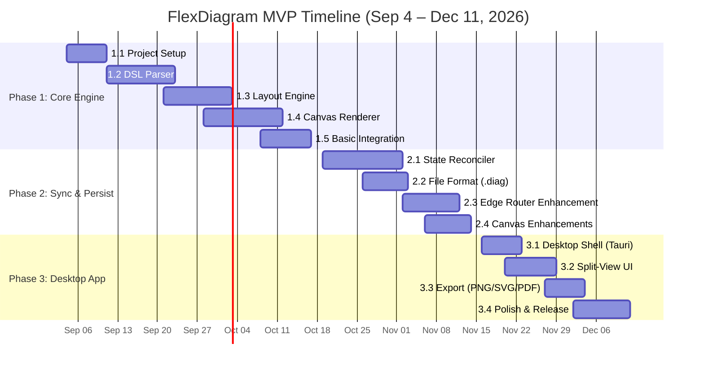

# FlexDiagram — Work Breakdown Structure & Implementation TODO

> **Project Mission:** Eliminate the frustration of auto-layout diagram overlap by combining the speed of code-based diagram authoring with free-form canvas position fine-tuning (*"Code first, Shape later"*).

- **Project Kickoff:** September 4, 2026
- **Architecture Baseline:** 4-step closed-loop pipeline (Parser → State Reconciler & Layout Engine → Canvas Renderer → Serializer)
- **Target App Footprint:** Tauri v2 shell (< 15MB installer, < 60MB RAM, 60fps pan/zoom)
- **File Format:** Single `.diag` plain-text file with Git-friendly metadata comment block

---

## 1. Summary & Progress Dashboard

### 1.1 Phase Progress Summary

| Phase | Description | Timeline | Total Tasks | Completed | Progress | Total Effort | Status |
| :--- | :--- | :--- | :---: | :---: | :---: | :---: | :--- |
| **Phase 1** | **Core Engine** (CLI/Web MVP) | Weeks 1–6 (Sep 4 – Oct 16, 2026) | 27 | 27 | 100% | 6S, 17M, 4L | 🟢 Complete |
| **Phase 2** | **Sync & Persistence** (Reconciler & Edge Router) | Weeks 7–10 (Oct 19 – Nov 13, 2026) | 15 | 15 | 100% | 2S, 5M, 7L, 1XL | 🟢 Complete |
| **Phase 3** | **Cross-platform App & Enhancements** (Tauri & v0.2.0) | Weeks 11–14 (Nov 16 – Dec 11, 2026) | 22 | 22 | 100% | 7S, 12M, 3L | 🟢 Complete |
| **Total** | **MVP Full Scope + v0.2.0** | **14 Weeks** | **64** | **64** | **100%** | **15S, 34M, 14L, 1XL** | **🟢 Completed / Shipped** |

```
Progress: [==================================================] 100% (64/64 tasks)
```

---

### 1.2 Effort Estimation Scale

Each task is assigned an estimated effort score based on engineering complexity and risk:

| Size | Nominal Duration | Description | Typical Activities |
| :---: | :---: | :--- | :--- |
| **`[S]`** | 0.5 – 1.5 days (~4–12h) | Straightforward task, well-defined patterns, minimal dependencies. | Config setup, basic UI controls, static format validation, asset generation. |
| **`[M]`** | 2 – 4 days (~16–32h) | Standard feature implementation, module interfaces, moderate logic. | Tokenizer rules, node rendering primitives, pan/zoom canvas interaction. |
| **`[L]`** | 1 – 2 weeks (~40–80h) | Core algorithmic component, deep integration, tricky edge cases. | AST parser with error recovery, Dagre pinned constraint handling, orthogonal edge routing. |
| **`[XL]`** | 2 – 3 weeks (~80–120h) | Foundational architectural subsystem with multi-variable constraints. | Incremental layout engine that respects existing geometry without canvas jitter. |

---

### 1.3 Core Architectural Closed Loop

```
+-----------------------------------------------------------------------------------+
|                                  FlexDiagram Loop                                  |
|                                                                                   |
|   1. DSL Code Editor  --->  Parse AST  --->  Extract Nodes & Edges                |
|                                                     |                             |
|   2. Merge Metadata   <---  State Reconciler  <-----+                             |
|          |                  (Preserve Pinned, Assign New)                         |
|          v                                                                        |
|      Layout Engine    --->  Compute DAG / Free-Space Placement                    |
|          |                                                                        |
|          v                                                                        |
|   3. Interactive Canvas ->  Render Nodes + Orthogonal Edge Routing                |
|          |                                                                        |
|          v (User drag/move)                                                       |
|   4. Update Coordinates ->  Serialize .diag with JSON comment block               |
+-----------------------------------------------------------------------------------+
```

---

## Phase 1: Core Engine (Target: Weeks 1–6)

*Objective:* Deliver a fully operational parser, auto-layout computation pipeline, and 60fps canvas renderer running in a browser/CLI environment, supporting the basic DSL syntax.

### 1.1 Project Setup
Focuses on repository foundation, developer ergonomics, and automated build verification.

- [x] `[S]` **Initialize project repository and structure**
  - Setup directory hierarchy (`/src`, `/packages/core`, `/packages/canvas`, `/packages/desktop`, `/docs`).
  - Configure `.gitignore`, README, license (MIT/Apache-2.0), and base configuration files.
- [x] `[M]` **Set up Tauri v2 project skeleton**
  - Scaffold Tauri v2 with Rust backend and web frontend template (Vite + TypeScript).
  - Verify cargo build and cross-compilation toolchain on Linux/macOS/Windows.
- [x] `[S]` **Configure TypeScript/build tooling**
  - Configure strict `tsconfig.json` paths, module resolution (ESNext), and Vite build bundling.
  - Set up path aliases (`@core/*`, `@canvas/*`, `@models/*`).
- [x] `[S]` **Set up linting and formatting (ESLint, Prettier)**
  - Integrate ESLint 9+ flat config with TypeScript-ESLint, Prettier, and git hook scripts (`simple-git-hooks` or `husky`).
  - Enforce code style consistency across frontend and Rust (`cargo fmt`, `cargo clippy`).
- [x] `[M]` **Create CI/CD pipeline (GitHub Actions)**
  - Automate pull request checks: lint, typecheck, unit tests, and cross-platform matrix build (Ubuntu, Windows, macOS).
  - Configure artifact upload for preview desktop builds.

### 1.2 DSL Parser
Responsible for translating human-written `.diag` text into a strongly typed Abstract Syntax Tree (AST) with resilient error reporting.

- [x] `[M]` **Define DSL grammar specification**
  - Formalize EBNF / grammar rules for nodes `[Rectangle]`, `(Database)`, arrows `->`, and labels `: Label`.
  - Document token boundaries, whitespace rules, escaped characters, and comment syntax (`//` and `/* */`).
- [x] `[M]` **Implement tokenizer/lexer**
  - Implement zero-dependency lexer that emits token stream with column, line, and byte offset indices.
  - Handle edge cases: multi-line comments, special punctuation inside labels, trailing spaces.
- [x] `[L]` **Implement parser (AST generation)**
  - Construct typed AST: `DiagramAST`, `NodeDeclaration`, `EdgeDeclaration`, `ShapeType` (`Rectangle` | `Cylinder`).
  - Provide fallback/recovery mode so typing incomplete lines does not crash the entire AST.
- [x] `[M]` **Implement Stable ID generation for nodes**
  - Define deterministic hashing/slugification for node labels to assign persistent `node_id`s.
  - Ensure rename detection mapping works between label edits and underlying IDs.
- [x] `[M]` **Add syntax error reporting with line numbers**
  - Emit user-friendly error diagnostics (e.g., `Expected '->' after node definition at line 4, col 12`).
  - Structure diagnostics payload compatible with code editor gutter markers.
- [x] `[M]` **Write unit tests for parser**
  - Comprehensive test suite covering valid diagrams, malformed tokens, nested braces, empty files, and unicode characters.
  - Target > 90% code coverage on the parsing package.

### 1.3 Layout Engine
Calculates coordinates for nodes and initial edge connection points using hierarchical graph algorithms.

- [x] `[S]` **Integrate Dagre library**
  - Add Dagre/Dagre-d3 layout library (or typed fork `@dagrejs/dagre`).
  - Create wrapper service abstracting layout inputs (`nodes`, `edges`, `layoutOptions`).
- [x] `[M]` **Implement node layout computation**
  - Calculate node dimensions based on label length, padding, and shape type.
  - Run Dagre layout pass to assign initial `(x, y)` coordinate vectors and bounding boxes.
- [x] `[M]` **Implement edge routing (basic)**
  - Compute straight or cubic Bezier routing points from source node boundary to target node boundary.
  - Calculate angle of entry for arrowheads.
- [x] `[L]` **Handle pinned node constraints**
  - Intercept Dagre layout output; lock pinned coordinates `(x, y)` while permitting floating nodes to distribute around them.
  - Explore hybrid Dagre/WebCola constraint relaxation for pinned graph elements.
- [x] `[M]` **Write unit tests for layout**
  - Verify layout stability, deterministic output coordinates for identical AST inputs, and boundary margin separation.

### 1.4 Canvas Renderer
Provides an interactive viewport capable of smooth 60fps rendering, panning, zooming, and node repositioning.

- [x] `[M]` **Set up HTML5 Canvas or PixiJS**
  - Initialize high-DPI (Retina) Canvas 2D or PixiJS rendering context.
  - Implement render loop with dirty-flag checking to prevent idle CPU battery drain.
- [x] `[M]` **Render rectangle nodes with labels**
  - Render square bracket `[Node]` syntax as clean rounded rectangles with border stroke, drop shadow, and centered text.
  - Support automatic text truncation or multi-line wrap for long labels.
- [x] `[M]` **Render cylinder/database nodes**
  - Render parenthesis `(Database)` syntax as 2.5D cylinder geometry with top elliptical cap and curved body.
  - Handle distinct styling (e.g., database storage accent fill).
- [x] `[M]` **Render directed edges with arrows**
  - Draw crisp lines with triangular arrowhead markers oriented along the direction vector.
  - Ensure clean docking points at node boundary intersections.
- [x] `[S]` **Render edge labels**
  - Render `: label` text centered along edge segments with translucent background badge for readability.
- [x] `[M]` **Implement pan and zoom**
  - Smooth pan (middle-click drag or space+left-click drag) and zoom-to-cursor (mouse wheel / touchpad pinch).
  - Enforce zoom bounds (e.g., 0.1x to 3.0x) with coordinate space transforms (`screenToWorld`, `worldToScreen`).
- [x] `[L]` **Implement node drag-and-drop**
  - Hit testing for pointer interactions; handle mouse down, drag, and release events.
  - Real-time coordinate updates with smooth 60fps bounding box updates during drag.
- [x] `[S]` **Visual feedback for pinned/unpinned nodes**
  - Display visual pin indicator (e.g., small pin badge, distinct border accent, or subtle lock icon) for manually repositioned nodes.

### 1.5 Basic Integration
Connects the AST, Layout, and Canvas components into a functioning end-to-end prototype.

- [x] `[M]` **Wire parser output to layout engine**
  - Stream parsed AST changes directly into the layout calculation service.
- [x] `[M]` **Wire layout output to canvas renderer**
  - Ingest computed graph layout directly into the canvas scene graph.
- [x] `[L]` **Implement basic code → canvas live update**
  - Establish reactive unidirectional event bus: DSL text input changes → debounced reparse → layout pass → canvas redraw.
  - Maintain viewport camera position (zoom/pan) across code edits.

---

## Phase 2: Sync & Persistence (Target: Weeks 7–10)

*Objective:* Solve the core diagramming pain point: allow manual canvas fine-tuning without losing edits when updating DSL code, alongside Git-friendly `.diag` serialization and orthogonal edge routing.

### 2.1 State Reconciler
The intellectual core of FlexDiagram. Merges incoming code AST with previous layout metadata to resolve positioning conflicts.

- [x] `[L]` **Implement AST diff/merge with layout metadata**
  - Compare incoming AST against current metadata table using Stable Node IDs.
  - Classify nodes: `RetainedPinned`, `RetainedUnpinned`, `NewlyCreated`, `Deleted`.
- [x] `[L]` **Handle node additions (auto-layout to free space)**
  - Position new nodes in adjacent open canvas space without overlapping pinned elements or disrupting manual clusters.
  - Apply spatial collision detection (AABB spatial hashing or Voronoi/Delaunay relaxation).
- [x] `[S]` **Handle node deletions (cleanup metadata)**
  - Purge orphaned node records and edge geometry from metadata state when deleted from DSL.
- [x] `[M]` **Handle node renames (preserve position)**
  - Detect rename heuristics (e.g., ID retention or similarity match) so changing `[Order Svc]` to `[Order Service]` retains canvas position.
- [x] `[XL]` **Incremental layout (don't disturb pinned nodes)**
  - Execute localized partial layout passes that accommodate new graph branches while guaranteeing zero coordinate drift for pinned nodes.

### 2.2 File Format
Defines and executes the unified `.diag` single-file format containing clean DSL code and a trailing comment metadata block.

- [x] `[M]` **Implement .diag serializer (DSL + metadata comments)**
  - Generate clean text output: human-readable DSL at the top, appended with `/* flexdiagram-metadata: { ... } */`.
  - Format JSON metadata with deterministic key sorting for clean Git diffs.
- [x] `[M]` **Implement .diag deserializer**
  - Split `.diag` file into DSL code string and JSON metadata object.
  - Validate metadata schema (node positions, pinned flags, edge route points) with fallback recovery if metadata is tampered with or absent.
- [x] `[S]` **Validate file format compatibility with git diff**
  - Ensure modifying one node's position only updates its corresponding JSON line in the metadata block, preventing massive multi-line diff noise.
- [x] `[M]` **Write integration tests for save/load roundtrip**
  - Test suite: DSL with metadata → parse & load → canvas mutate → serialize → re-parse; verify absolute coordinate and syntax equality.

### 2.3 Edge Router Enhancement
Transforms basic straight connections into clean orthogonal (Manhattan) lines that actively avoid overlapping node bodies.

- [x] `[L]` **Implement orthogonal edge routing**
  - Implement grid-based A* routing or Bend-minimizing Dijkstra algorithm around node bounding boxes with clearance padding.
  - Generate 90-degree orthogonal polyline segments (`waypoints: [{x, y}, ...]`).
- [x] `[M]` **Re-route edges on node move**
  - Dynamically recalculate connected edge paths in real time while a node is actively dragged.
- [x] `[L]` **Handle edge cases (self-loops, overlapping edges)**
  - Route self-referential edges (`[A] -> [A]`) via dedicated loop offsets.
  - Apply lane-shifting/separation for parallel bidirectional edges (`[A] -> [B]` and `[B] -> [A]`).

### 2.4 Canvas Enhancements
Advanced direct manipulation features that turn the canvas into an intuitive design surface.

- [x] `[L]` **Multi-node selection and move**
  - Implement marquee/lasso box selection and shift-click toggle.
  - Group drag: translate multiple selected nodes simultaneously while preserving their relative spatial offsets.
- [x] `[M]` **Snap-to-grid / alignment guides**
  - Implement configurable grid snapping (e.g., 10px / 20px).
  - Dynamic smart alignment guides (center-line, edge-alignment indicators) when dragging nodes near peers.
- [x] `[L]` **Undo/Redo for canvas operations**
  - Implement command pattern history stack for position changes, pin toggles, and metadata edits.
  - Support standard keyboard shortcuts (`Ctrl+Z` / `Ctrl+Shift+Z` / `Cmd+Z`).

---

## Phase 3: Cross-platform App (Target: Weeks 11–14)

*Objective:* Package the engine into a lightweight, high-performance desktop application with a split-view code editor, native OS dialogs, and vector/raster export capabilities.

### 3.1 Desktop Shell
Leverages Tauri v2 to deliver a lightweight (< 15MB, < 60MB RAM) native desktop wrapper.

- [x] `[S]` **Tauri v2 window management**
  - Configure native window decorations, minimum window bounds (1024x768), background theme color, and window state persistence (size/position).
- [x] `[M]` **Native file open/save dialogs**
  - Implement Tauri Rust commands to invoke OS file pickers for `.diag` files with dirty state warnings on unsaved exit.
  - Add auto-save / background write throttler.
- [x] `[M]` **Menu bar and keyboard shortcuts**
  - Native application menu (File, Edit, View, Export, Help).
  - Register global accelerators (`Cmd/Ctrl+O`, `Cmd/Ctrl+S`, `Cmd/Ctrl+E`, `Cmd/Ctrl+R`).
- [x] `[S]` **App icon and branding**
  - Generate multi-resolution desktop icons (`.ico`, `.icns`, `.png`) and splash asset.

### 3.2 Split-View UI
Dual-pane layout combining a modern code editor on the left with the interactive canvas on the right.

- [x] `[M]` **Integrate Monaco Editor or CodeMirror 6**
  - Embed lightweight CodeMirror 6 or Monaco Editor instance.
  - Synchronize theme (Dark/Light mode) across editor and canvas.
- [x] `[S]` **Implement resizable split pane**
  - Draggable split divider with collapse toggles (Hide Code / Full Canvas, or Code Only).
  - Persist split pane ratio in local app preferences.
- [x] `[M]` **Syntax highlighting for .diag DSL**
  - Create syntax definition for `.diag` grammar (highlight nodes, shape brackets, arrow connectors, and labels).
- [x] `[M]` **Error markers in editor gutter**
  - Render inline squiggly underlines and gutter warning/error icons matching parser diagnostics.

### 3.3 Export
Exporting publication-quality diagrams for documentation, slide decks, and web embedding.

- [x] `[S]` **Export to PNG**
  - Render canvas buffer to high-resolution raster PNG (support 1x, 2x, 3x pixel density scaling for presentations).
  - Option to include transparent or solid background.
- [x] `[M]` **Export to SVG**
  - Generate clean, scalable vector SVG with embedded CSS styles, text elements, and sharp vector paths.
- [x] `[M]` **Export to PDF**
  - Generate single-page vector PDF suitable for architecture specification sheets and printing.

### 3.4 Polish & Release
Quality assurance, profiling, packaging, and launch preparation for public release.

- [x] `[L]` **Performance optimization and profiling**
  - Stress test with graphs of 100+ nodes and 200+ edges.
  - Optimize canvas draw calls; verify sustained 60fps pan/zoom and memory usage under 60MB.
- [x] `[L]` **Cross-platform testing (Windows, macOS, Linux)**
  - Execute end-to-end test scenarios on macOS (Apple Silicon / Intel), Windows 11, and Ubuntu Linux.
  - Validate native font rendering, DPI scaling, and trackpad gestures.
- [x] `[L]` **Build installers for all platforms**
  - Configure GitHub Actions release workflow producing `.dmg` (macOS signed/notarized), `.msi`/`.exe` (Windows), and `.deb`/`.AppImage` (Linux).
  - Verify installer binary sizes remain strictly under 15MB.
- [x] `[M]` **Write user documentation / README**
  - Comprehensive user guide: DSL syntax cheat sheet, keyboard shortcuts, `.diag` file structure explanation, and Git collaboration workflows.
- [x] `[S]` **Create demo video / screenshots**
  - Record animated GIFs / short video demonstrating the core value proposition: typing DSL code, re-arranging nodes on canvas, editing code again without position reset.

### 3.5 Enhancements & Compatibility (v0.2.0)
Advanced diagram authoring ergonomics, PlantUML syntax compatibility, and visual styling options.

- [x] `[M]` **PlantUML syntax compatibility in parser**
  - Silently filter and tolerate `@startuml`, `@enduml`, `!theme`, `skinparam`, `title`, `header`, `footer`.
  - Support single-quote `'` PlantUML comment lines and inline comments.
  - Built-in PlantUML sample template in template picker.
- [x] `[M]` **Rich edge connectors (dotted & dashed arrows)**
  - Parse and route alternative arrow notations: `-->`, `..>`, `-.->`, `<..>`, `...`.
  - Model `EdgeStyle` (`solid`, `dashed`, `dotted`) and render with canvas `setLineDash` and SVG `stroke-dasharray`.
- [x] `[M]` **White / Light Theme support**
  - Light mode CSS theme with clean white canvas background (`#ffffff`), high-contrast dark text, and subtle node borders.
  - Header toolbar theme switcher button (`☀️ Light` / `🌙 Dark`).
  - Theme-synchronized SVG and PNG graphic exports.
- [x] `[S]` **Database cylinder top cap contrast fix**
  - Implement `nodeCylinderCap` theme token (`#e2e8f0` in light, `#222733` in dark) resolving black cylinder top cap defect.
- [x] `[M]` **Intuitive canvas pan navigation & tool modes**
  - Default left-drag panning on empty canvas space without requiring modifier keys.
  - Floating HUD tool mode switcher between `✋ Pan` mode and `↖ Select` mode.
  - Keyboard shortcuts <kbd>H</kbd> (Pan), <kbd>V</kbd> (Select), and <kbd>Space</kbd> (temporary pan).
- [x] `[S]` **Canvas grid visibility toggle**
  - Background dot matrix grid display toggle button (`▦ Grid` / `⬚ Grid`) in header and HUD.

---

## 2. Milestone Schedule & Timeline



| Milestone | Target Date | Critical Deliverables | Exit Criteria |
| :--- | :--- | :--- | :--- |
| **M1: Core Engine Working** | October 16, 2026 | DSL Parser, Dagre Layout, Interactive Canvas | Able to write DSL in browser and see rendered nodes with drag-and-drop capability. |
| **M2: Closed-Loop Sync** | November 13, 2026 | State Reconciler, `.diag` serializer, Orthogonal Router | Dragging nodes pins coordinates; subsequent DSL code edits preserve pinned coordinates; `.diag` saves cleanly. |
| **M3: Release Candidate (MVP)** | December 11, 2026 | Tauri v2 Desktop App, Split-view, Export Engine | Cross-platform installers built (< 15MB), < 60MB RAM usage, PNG/SVG export working, documentation complete. |

---

## 3. Maintenance & Tracking Guidelines

1. **Task Updates:** When beginning work on an item, update the status in this document or relevant issue tracker.
2. **Task Completion:** Mark checkboxes with `[x]`, update the progress counter at the top of the file, and link the relevant commit / PR.
3. **Scope Adjustments:** If an item increases in complexity, break it into numbered subtasks while preserving the original WBS identifier hierarchy (e.g., `2.1.1`, `2.1.2`).
4. **Effort Calibration:** Review sizing estimates at the conclusion of each phase to calibrate future estimates.
